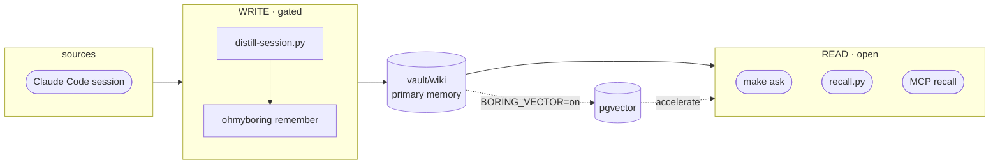

# ohmyboring

[English](README.md) · **한국어** · [日本語](README.ja.md)

[](https://github.com/jazz1x/ohmyboring/actions/workflows/ci.yml)

[](LICENSE)


**ohmyboring은 내가 어떻게 풀었는지를 기억합니다.** Claude Code / Kimi Code 세션과 적재 가능한 Codex 트랜스크립트를 로컬의 사람이 읽는 위키로 바꾸고, *"전에 이거 어떻게 했더라"* 싶을 때 필요한 부분을 다시 꺼내줍니다. **클라우드 0 · 로컬 LLM 친화.**

```bash
# 가장 빠름 — 원라이너: ~/oh-my-boring에 클론, 빌드, 훅/MCP/워커까지 연결.
sh -c "$(curl -fsSL https://raw.githubusercontent.com/jazz1x/ohmyboring/main/install.sh)"
```

또는 단계별로:

```bash
git clone https://github.com/jazz1x/ohmyboring.git ~/oh-my-boring
cd ~/oh-my-boring
make up
make verify-llm     # 제공자, chat 모델, embedding 모델, 벡터 차원 확인
make doctor         # 스택, 훅, Codex 워커/큐, 마지막 적재 확인
make readiness      # 아침 브리핑 의존 전 strict 게이트
make collect N=20   # 과거 Claude Code 세션으로 vault 채우기 (새 클론은 비어 있음)
make ask Q="docker build cache 문제 어떻게 고쳤더라?"
```

> 새로 클론하면 **vault가 비어 있어** 첫날 `make ask`는 찾을 게 없습니다. `make collect`로 Claude 과거 기록을 채우고 나면, 이후 Claude/Kimi 세션은 자동 축적되고 Codex는 적재 가능한 트랜스크립트를 워커가 처리합니다([적재하기](#적재하기-ingestion) 참고).

> **Docker**, **Python 3**, **jq**, **curl**, **git**, **make**, 그리고 로컬 LLM 서버 — **Ollama** 또는 **LM Studio** (또는 다른 OpenAI-compatible 엔드포인트)가 필요합니다.

**로컬 LLM 백엔드 선택:**

- **Ollama** — `llm.provider`를 `ollama`로 설정하세요. `make up`은 `ollama serve`가 떠 있는지 확인하고 `llm.model`과 `llm.embed_model`이 없으면 pull합니다. `make verify-llm`은 모델 존재 여부, 도달성, embedding 차원이 `llm.embed_dim`과 일치하는지 확인합니다.
- **LM Studio** — `llm.provider`를 `lmstudio`로 설정하세요. 로컬 서버를 시작하고 채팅 모델과 임베딩 모델을 수동으로 각각 하나씩 로드하세요. `make verify-llm`은 `/v1/models`로 정확한 model id를 확인하고 `/v1/embeddings`로 `llm.embed_dim`을 확인합니다. 자동 pull은 없습니다.
- **OpenAI-compatible** — vLLM, llama.cpp, 원격 OpenAI 엔드포인트 등을 쓰려면 `llm.provider`를 `openai-compatible`로 설정하세요. `make verify-llm`이 `/v1/models`와 embedding 차원을 확인합니다. 자동 pull은 없습니다.

모든 provider에 같은 계약이 적용됩니다: 채팅과 임베딩은 별도 서비스입니다; `llm.embed_dim`은 임베딩 모델이 실제로 반환한 벡터 차원과 같아야 합니다; 임베딩 모델을 바꾸면 `llm.embed_dim`을 갱신하고 `make reset`을 실행해야 합니다. Provider별 체크리스트는 [Ollama 런북](docs/runbooks/ollama.ko.md)과 [LM Studio 런북](docs/runbooks/lmstudio.ko.md)에, 벡터/그래프 계약은 [GraphRAG & Vector 계약 런북](docs/runbooks/graphrag.ko.md)에 있습니다.

**메모리 백엔드 선택:**

- **`BORING_VECTOR=off` (기본)** — wiki-first. `vault/wiki`를 직접 읽습니다. `/ask`, `/search`, `recall`, `context`는 Postgres 없이 동작하고, recency/claim/graph 엔드포인트(`brief`, `weekly_brief`, `project_status`, `decisions`, `risks`, `next_actions`, `stalled`, `neighbors`, `claims`, `events`, `corpus_status`)는 vector 모드를 켜기 전까지 명시적 오류를 반환합니다.
- **`BORING_VECTOR=on`** — pgvector가 의미 검색, 그래프(node/edge 테이블 + recursive CTE), claim 레지스터, 로컬 이벤트/쿼리 로그를 가속합니다. `make sync`는 `vault/wiki`를 임베딩과 그래프 엣지로 다시 적재합니다.

첫 실행 성공 기준:

- `make up`이 0으로 끝나고 `http://127.0.0.1:7700/health`가 200을 반환합니다.
- `make verify-llm`이 설정된 두 모델 id를 찾고 실제 embedding 차원이 `llm.embed_dim`과 같습니다.
- `make doctor`가 스택, 훅/MCP, 워커/큐, 최신 적재 상태를 숨은 실패 없이 보여줍니다.
- 예약 아침 브리핑을 믿기 전 `make readiness`가 초록불이어야 합니다.

---

## 기능

1. **자동 축적** — 세션이 끝나거나 Codex 워커가 적재 가능한 트랜스크립트를 찾으면 `vault/wiki`에 정리된 마크다운 노트로 변환됩니다. 수동 관리 불필요.
2. **마크다운 중심 메모리** — 일반 텍스트, 사람이 읽기 쉬움, git diff 가능. 검색도 마크다운을 직접 읽습니다.
3. **로컬 전용** — 임베딩과 요약이 Ollama, LM Studio 또는 다른 OpenAI-compatible 엔드포인트에서 실행됩니다. 외부 API나 토큰 없음.

선택적으로 **pgvector** 가속기(`BORING_VECTOR=on`)를 켜면 유사도 검색 + GraphRAG이 추가됩니다.

## 메모리 계약

ohmyboring은 대화 로그를 쌓아두는 도구가 아니라, 기억이 거짓말하지 않도록 작게 나눈 계약들의 묶음입니다.

| 계약 | 보장 |
| --- | --- |
| **청킹** | 노트 본문은 1,500자 단위, 200자 겹침으로 나뉩니다. 짧은 노트는 그대로 한 청크가 됩니다. 각 청크는 독립적으로 임베딩되고 `source_path#chunk_idx`로 저장되어, 긴 세션도 주변 맥락을 잃지 않고 검색됩니다. |
| **슬라이싱** | 읽기 표면은 에이전트에게 넘기기 전에 기억을 자릅니다. MCP `recall`은 `max_results`, `max_tokens`, `project`, `since_hours`로 제한되고, wiki-first recall은 같은 점수의 결과를 `source_path`로 결정화하며, 합성 프롬프트에는 6,000자 고정 문맥 상한이 있습니다. `ask` 출처 목록은 그 상한 안에 실제로 들어간 hit와 주입된 graph/claim 증거만 가리킵니다. 브리핑/상태 경로는 최신 원천 노트와 현재 클레임을 우선하며, 단일 project 브리핑 조각은 주입되는 현재/정체 클레임을 그 project로 좁히고, 브리핑 관련 문맥은 seed 원천 노트 4개, 관련 문서 3개, 관련 기록당 1,000자로 제한됩니다. 생성된 daily brief와 eval fixture는 원천 메모리 조각에서 제외되고, eval fixture는 브리핑 표면에서도 정리되거나 필터링됩니다. |
| **적재** | 파일별 파이프라인은 한 방향입니다: 파일 읽기, `frontmatter` 해석, 청크 분리, 임베딩, `upsert`, `prune`, 링크 투영. YAML에 오래된 `source_path`가 있어도 document/chunk `source_path`의 권위는 실제 파일 경로에 있고, 원본 증거 포인터는 `sources`에 둡니다. frontmatter 식별 필드(`origin`, `project`, `kind`)는 DB 필터나 relation lane에 들어가기 전에 parse boundary에서 공백이 정리됩니다. `sha`가 같으면 재임베딩을 건너뛰고, 바뀐 파일은 새 청크를 먼저 `upsert`한 뒤 오래된 꼬리 청크만 `prune`합니다. 생성 브리프는 적재에서 제외되어 요약이 원본 기억이 되지 않습니다. |
| **원본 증거** | 세션 증류는 먼저 원본 트랜스크립트를 git 추적에서 제외된 로컬 증거 파일(`data/raw-witness/`)로 복사한 뒤, 그 스냅샷에서 추출하고 증류합니다. 노트에는 로컬 `raw-witness/...#sha256=...` 출처 포인터만 저장하므로, 원본 대화 로그를 RAG 코퍼스에 넣지 않고도 출처를 감사할 수 있습니다. 원본 증거 스냅샷은 공개 전에 fsync되고, 공개 실패 시 이전 대상과 temp 없는 상태를 남깁니다. 로컬 바이트가 보존 정책으로 정리된 뒤에도 `#sha256` 조각은 필수입니다. 바이트 누락은 보존 경고일 뿐, 출처 계약을 약하게 만들 이유가 아닙니다. 용량은 숨은 무제한 캐시가 아니라 명시적인 보존 계약입니다: 예상 사용량은 대략 하루 평균 원본 트랜스크립트 바이트 × `BORING_RETENTION_RAW_WITNESS_DAYS`(기본 `90`일)입니다. `make retention`은 전체 원본 증거 용량(실제 개수와 바이트)을 보여주고, 오래된 스냅샷을 정리하거나 `BORING_RAW_WITNESS_DIR`로 위치를 옮길 수 있게 합니다. |
| **클레임** | 클레임은 시간축 위의 사실입니다. 정규화된 `(subject, predicate)`가 식별자이고, `value`가 현재 상태이며, `kind`/`confidence`가 사용 맥락을 말합니다(`fact`, `decision`, `assumption`, `risk`, `blocked`, `goal`, `term`, `next`). 대소문자와 구분자 표기 차이는 저장 전에 같은 축으로 접히므로, 더 최신 `value`가 이전 행을 대체하고 출처는 `source_path`로 남아, 브리핑이 오래된 본문 서술보다 최신 결정, 리스크, 차단 항목, 다음 행동을 우선할 수 있습니다. |
| **그래프** | 그래프는 결정론적입니다. `tool`, `concept`, `claim`은 `drudge` 내부의 추가 LLM 추출이 아니라 에이전트가 정리한 `frontmatter`에서 옵니다. Obsidian `relates_to`는 클레임 연속성, 정확한 도구/개념 겹침, 증거가 있는 의미 이웃, 작은 동일 프로젝트 최신성 보강 순서로 투영되고, 허브 노트가 과도한 그물망이 되지 않도록 상한이 걸립니다. `Graph-linked` 문맥은 공유 그래프 노드 근거(`shares N graph nodes: ...`)를 전달하고, 브리핑 관련 문맥은 클레임 축 근거(`shares N claim axes: ...`)도 전달할 수 있으므로, 관련 기록은 임베딩만으로 추측한 항목이 아니라 왜 이어졌는지 설명 가능한 항목으로 남습니다. GraphRAG 본문 문맥 경로는 더 엄격합니다: 공유 도구/개념 그래프 노드만 쓰고, 클레임 축 연속성은 별도 관련/클레임 권위 경로에 남기므로 상태 이력이 추가 GraphRAG 근거처럼 보이지 않습니다. 하나의 관련 문서가 여러 seed 기록이나 그래프 노드/클레임 축 양쪽으로 이어지면, 관련 기록을 중복으로 내지 않고 제목에서 seed 경로와 근거를 합칩니다. 같은 종류의 근거 노드는 개수를 표시하기 전에 중복 제거되고, 병합 근거가 강한 후보가 관련 문서 상한 적용 전에 먼저 정렬되며, 완전 동점은 `source_path`로 결정화되고, 브리핑 관련 문맥은 호출자가 다른 project를 명시하지 않는 한 각 seed 기록의 project 안에 머뭅니다. 브리핑 후처리는 새어 나온 relation metadata bullet을 버려, 관계 근거가 action item이 되지 않게 합니다. `remember`가 노트를 쓰면 그 노트의 `relates_to` 투영은 즉시 갱신되지만, 이웃 노트의 backlink는 다음 `sync` / 전체 `project_links`에서 조정됩니다. 그래서 회수는 즉시 가능하고 Obsidian 링크만 eventual consistency입니다. |

### GraphRAG 구현 노트

`BORING_VECTOR=on`일 때 `/ask`는 로컬 GraphRAG를 실행합니다. 먼저 vector 유사도와 BM25 full-text 검색으로 후보 풀을 만들어 RRF로 병합한 뒤, 공유 `uses`/`about` 도구/개념 그래프 노드를 따라 설정 가능한 **multi-hop 순회**(기본 깊이는 문서 간 2 hop)로 이웃을 확장합니다. 가벼운 **그래프 reranker**는 상위 vector hit를 앵커로 유지하면서 나머지를 공유 그래프 노드, 공유 클레임 축, 그래프 차수, 최신성 감쇠로 재채점합니다. 상위 관련 문서는 각각 상한을 둔 채 합성 프롬프트에 주입되어 문맥 예산이 bounded로 유지됩니다. `/search`는 외부 recall 계약으로 원래 RRF 순위를 그대로 유지하므로, `make eval-graphrag`가 `data/eval/graph-golden.json`에서 vector-only 검색과 전체 GraphRAG 경로를 A/B 비교해 Recall@3와 graph-only 구출을 리포트할 수 있습니다. 쿼리 텔레메트리는 모든 `/ask` 호출의 `graph_context_chars`와 `graph_source_count`를 기록해 그래프 경로를 관찰 가능하게 합니다. 전체 계약, 현재 한계, 관찰 가능성은 [GraphRAG & Vector 계약 런북](docs/runbooks/graphrag.ko.md)을 참고하세요.

아직 구현하지 않은 것은 neural 그래프 reranker와 `uses`/`about` 이외의 임의 edge-kind 확장입니다. 현재 결정론적 feature 기반 mixer는 bounded하고 저렴하며 개인 메모리 규모에 충분합니다. 향후 eval에서 더 깊거나 학습된 reranking으로 메울 수 있는 recall 공백이 보이면, 스키마는 이미 k-hop recursive CTE를 지원하고 API 계약 변경 없이 graph DB로 마이그레이션할 수 있습니다.

이 계약들이 대변하는 철학은 분명합니다: `vault/wiki`가 진짜 기억이고, 원본 증거는 로컬 증거이며, DB는 다시 만들 수 있는 가속기입니다. 경계는 추측하지 않고 아는 것만 말해야 합니다. 원본 세션은 쓰기 문에서 한 번 정제되고, 읽기 문은 빠르고, 제한되어 있고, 로컬이며, 설명 가능해야 합니다.

---

## 적재하기 (ingestion)

메모리가 들어오는 경로는 네 가지입니다 — 설정 후 자동 경로들은 거의 손댈 일이 없습니다:

| 방법 | 명령 | 언제 |
| --- | --- | --- |
| **자동 (세션 종료 시)** | SessionEnd 훅 (`install.sh`가 설치) | 모든 Claude Code / Kimi 세션 — `hooks/distill-session.py`가 트랜스크립트를 증류해 `remember`합니다. 짝이 되는 `UserPromptSubmit` 훅(`recall.py`)이 관련 과거 메모리를 새 프롬프트에 자동 주입합니다. |
| **자동 (Codex 워커)** | 호스트 launchd/cron 워커 (`install.sh`가 설치) | Codex에는 SessionEnd 훅이 없습니다. 표준 쓰기 경로는 호스트 워커입니다. 이 워커가 20분마다 `~/.codex/sessions/**/*.jsonl`을 스캔하고, 아직 쓰이는 중인 transcript와 실제 subagent rollout은 건너뛰며, 적재 가능한 transcript를 같은 `remember` 경로로 저장합니다. `hermes-agent`가 켜져 있으면 중복 `codex-memory-ingest-worker`도 돌 수 있습니다. 호스트 워커가 정상일 때 `make doctor`는 이 선택 워커의 문제를 notice로 보고합니다. |
| **과거 세션 백필** | `make collect [N=20]` | 설치 직후, 비어 있는 vault를 `~/.claude/projects` 기록으로 채울 때. 최신순, 멱등(세션별 마커로 이미 증류한 건 건너뜀), 한 번에 `N`개만 처리해 CPU를 독점하지 않음. |
| **지금 바로 (세션 안 끝내고)** | `make distill-now` · `make remember M="…"` | 세션을 끝내지 않고 즉시 적재할 때. `distill-now`는 **현재** 트랜스크립트를 그때그때 다시 증류하고 마커를 남기지 않으므로, 세션 종료 시의 정상 적재도 그대로 동작합니다(초기 노트 + 최종 노트가 함께 생길 수 있음). `remember`는 직접 작성한 노트를 저장합니다. |

### 훅 수동 연결

`install.sh`가 자동으로 해줍니다. 다시 하려면(또는 `BORING_WIRE=0`로 실행했다면):

```bash
python3 agents/shared/agent_wiring.py --install \
  --boring-home ~/oh-my-boring --server-name ohmyboring \
  --server-url http://localhost:7700/mcp
```

이 명령은 Claude/Kimi 훅, Cursor/Codex MCP 항목, Codex 호스트 워커, 그리고 `hermes-agent`가 켜진 경우 Hermes cron 워커를 설정합니다. Claude만 직접 편집하려면 `~/.claude/settings.json`에 `python3 ~/oh-my-boring/hooks/distill-session.py`를 실행하는 `SessionEnd` 훅과 `recall.py`를 실행하는 `UserPromptSubmit` 훅을 추가합니다.

---

## 내 메모리 보기

노트는 그냥 마크다운이므로, **`vault/` 폴더를 [Obsidian](https://obsidian.md) 보관함(vault)으로 열면** 그래프 뷰, 백링크, 태그, 전문 검색을 그대로 쓸 수 있습니다. 컴파일된 노트에는 이미 Obsidian-safe `tags`와 `[[wiki-NNNN]]` `relates_to` 링크가 들어 있어, 그래프 뷰가 메모리의 연결 관계를 바로 그려 줍니다(`BORING_VECTOR=on`일 때 GraphRAG 그래프가 이 링크로 투영되어 가장 풍부합니다). `remember` 직후에는 새 노트 쪽 링크가 먼저 보이고, 이웃 backlink는 다음 `sync`에서 따라옵니다. 별도 UI를 만들 필요가 없습니다. Obsidian이 만드는 `.obsidian/` 작업 폴더는 gitignore 처리되어, 내 레이아웃이 로컬에만 남고 git에 새지 않습니다.

---

## 아키텍처



- **Read door** — 로컬이고 제한됩니다. `recall.py`와 MCP `recall`은 LLM 합성 없이 `vault/wiki`를 직접 읽고, `make ask` / HTTP `/ask`는 vector off일 때 같은 wiki-first 검색을 쓴 뒤 로컬 합성 모델을 실행합니다.
- **Write door** — gated. `distill-session.py`가 로컬 LLM을 호출하고 ohmyboring의 `remember` MCP tool로 기록합니다.
- **Duplicate gate** — 중복 노트는 기본적으로 건너뜁니다. 같은 세션이나 강한 롤아웃/수동 중복에서 더 충실한 노트가 들어오면 `remember`가 같은 `wiki-NNNN.md`를 다시 쓰고 재적재합니다. 세션 ID가 없는 중복은 단순 주제 겹침이 아니라 보수적인 식별 신호와 project 및 origin 호환성이 있어야 합니다. 누락되었거나 빈 project frontmatter는 호환성 검사 전에 없는 값으로 보고 파일 경로에서 도출합니다.
- **Write-maintenance lock** — vector 모드의 `sync`, `compact`, `remember`, `forget`은 DB 기반 graph/relation 상태를 다시 쓸 때 하나의 `sync_lock`을 공유합니다. bulk write는 전체 link projection과 섞이지 않고 기다리며, `/health`는 이 lane을 `sync: running`으로 보여줍니다.

### 작업 흐름 그래프 계약

적재 루프에는 `drudge/src/workflow.rs`에 Rust 쪽 작업 흐름 그래프 계약이 있고, `drudge/WORKFLOW.md`에 문서화되어 있습니다. 세션 발견, 증류, 해상도 검증, 보강, `remember`, 마커 갱신, 이벤트 기록, readiness 투영을 닫힌 타입의 랭그래프 상태 그래프로 표현합니다. 두 번째 런타임 오케스트레이터는 아닙니다. Python 훅/워커는 계속 호스트 I/O를 맡고, Rust는 노드/엣지 어휘와 그래프 형태 테스트를 소유합니다.

---

## 설정

정책은 **`boring.json`**(`make up` 시 `boring.example.json`에서 생성)에:

```json
{
  "$schema": "https://raw.githubusercontent.com/jazz1x/ohmyboring/main/boring.schema.json",
  "schema_version": 2,
  "note_lang": "auto",
  "llm": {
    "provider": "ollama",
    "base_url": "http://host.docker.internal:11434/v1",
    "model": "qwen3:14b",
    "embed_model": "bge-m3",
    "embed_dim": 1024,
    "api_key_env": "BORING_LLM_API_KEY",
    "bootstrap": "auto"
  },
  "repos": [
    {"match": "your-company", "origin": "company", "name": "your-company"},
    {"match": "~/code", "origin": "personal", "name": "mine"}
  ],
  "agents": [
    {"id": "claude-code", "enabled": true, "format": "claude-json", "paths": ["~/.claude/projects"]}
  ]
}
```

| Key | 용도 |
|---|---|
| `note_lang` | `auto` · `ko` · `en` |
| `llm.provider` | `ollama`(모델 pull) · `lmstudio`(앱에서 로드, pull 없음) · `openai-compatible`(vLLM / llama.cpp / 원격) |
| `llm.base_url` / `llm.model` | OpenAI-compatible `/v1` 엔드포인트 + 합성 모델 |
| `llm.embed_model` / `llm.embed_dim` | 임베딩 모델 + 그 벡터 차원(커널의 유일한 모델) |
| `llm.bootstrap` | `auto` = 부트스트랩이 기동/pull 가능 · `manual` = 헬스체크만(서버는 사용자 소유) |
| `repos[]` | 경로/remote 규칙 → `origin=personal/company/mirror/community` |
| `agents[]` | vector mode ingest source |

MCP 도구 `classify_repo`는 이 파일을 직접 갱신합니다. 쓰기 전에 잘못된 `origin` 값을 거부하고, 수정된 JSON은 같은 디렉터리의 원자적 쓰기 경계를 통해 반영합니다.

**LLM 백엔드 전환**은 config 블록 하나로 끝납니다. `make up`은 `scripts/llm-providers/<provider>.sh` 로 디스패치합니다.

### 로컬 LLM 백엔드

ohmyboring은 OpenAI-compatible `/v1` 서버라면 어디에나 연결할 수 있습니다. 공식 지원하는 백엔드는 **Ollama**와 **LM Studio** 두 가지이며, vLLM·llama.cpp·원격 OpenAI-compatible 서버 등은 `llm.provider`를 `openai-compatible`로 설정해 사용할 수 있지만 공식 지원은 아닙니다.

#### Ollama

`boring.example.json`의 기본값입니다. `make up`은 `scripts/llm-providers/ollama.sh`로 디스패치하여 Ollama가 실행 중인지 확인하고 필요하면 `llm.model` / `llm.embed_model`을 pull합니다. Docker 컨테이너 안에서는 호스트 Ollama에 `host.docker.internal`로 접근하며, 기본 `boring.json`도 이미 그렇게 설정되어 있습니다.

빠른 확인/시작:

```bash
make ollama
curl -s http://localhost:11434/api/tags
make verify-llm
```

#### LM Studio

LM Studio는 OpenAI-compatible `/v1` 서버로 붙습니다. Docker 컨테이너가 호스트의 LM Studio에 접근해야 하므로 `boring.json`에는 `host.docker.internal`을 쓰고, 호스트에서 직접 확인하거나 벤치마크할 때만 `localhost`를 씁니다.

```json
{
  "llm": {
    "provider": "lmstudio",
    "base_url": "http://host.docker.internal:1234/v1",
    "model": "<`/v1/models`가 반환하는 정확한 chat model id>",
    "embed_model": "<`/v1/models`가 반환하는 정확한 embedding model id>",
    "embed_dim": 768,
    "api_key_env": "BORING_LLM_API_KEY",
    "bootstrap": "manual"
  }
}
```

LM Studio 로컬 서버를 시작하고 chat 모델과 embedding 모델을 각각 하나씩 로드한 뒤, `make up` 전에 확인합니다:

```bash
curl -s http://localhost:1234/v1/models | jq -r '.data[].id'
make verify-llm
make up
make doctor
make readiness
```

모델 id는 LM Studio가 반환한 값과 정확히 같아야 합니다. `make verify-llm`은 `/v1/embeddings`도 직접 호출해 실제 벡터 길이가 `llm.embed_dim`과 같은지 확인합니다. 현재 1024d 릴리즈 경로에서는 LM Studio가 `bge-m3`를 서빙할 때에만 vector-ready이고, `text-embedding-nomic-embed-text-v1.5`는 별도의 768d reset/re-index 경로입니다. 전체 체크리스트는 [LM Studio 런북](docs/runbooks/lmstudio.ko.md), [Ollama 런북](docs/runbooks/ollama.ko.md), [GraphRAG & Vector 계약 런북](docs/runbooks/graphrag.ko.md)을 참고하세요.

`.env`는 이제 시크릿 + 런타임 오버라이드 전용:

| Variable | 용도 |
|---|---|
| `BORING_VECTOR` | `on` 시 pgvector 활성화(선택) |
| `BORING_LLM_BASE_URL` / `BORING_LLM_MODEL` | `llm.base_url` / `llm.model` 런타임 오버라이드(선택). `drudge` 바이너리를 호스트에서 직접 실행한다면 `BORING_LLM_BASE_URL=http://localhost:11434/v1` 설정 |
| `BORING_LLM_API_KEY` | `llm.api_key_env`가 여기를 가리킬 때의 API 키(인증 provider) |
| `DOCKER_BIN` | GUI/launchd 환경의 `PATH`에 Docker가 없을 때 사용할 선택적 Docker CLI 경로 |
| `BORING_DISTILL_RESOLUTION` | 적재 해상도 계약: `compact`, `standard`, `evidence`(기본), `forensic`; 잘못된 값은 증류 시작 전에 실패; 검증 실패 시 한 번 보강하고 그래도 실패하면 `remember` 차단 |
| `BORING_RAW_WITNESS_DIR` | 원본 트랜스크립트 증거 스냅샷 경로의 선택적 재지정; 기본값은 `BORING_HOME` 아래 git 추적 제외 `data/raw-witness` |
| `BORING_RETENTION_RAW_WITNESS_DAYS` | `make retention`이 원본 증거 스냅샷을 보존하는 기간; 기본값 `90`일 |
| `DISTILL_CLAMP` | Claude/Kimi 직접 SessionEnd hook이 로컬 LLM에 보내는 최대 문자 수; 로컬 모델 timeout을 피하기 위해 기본값은 `2000`. `0`은 clamp 비활성화이며, 잘못된 값이나 음수는 증류 전에 실패합니다. Hermes worker offer는 같은 clamp 계약을 `INGEST_CLAMP`(`4000`)로 사용합니다 |
| `CODEX_DISTILL_CLAMP` | Codex 세션에서 추출해 distill LLM에 보내는 최대 문자 수; 기본값은 `INGEST_CLAMP`, 그다음 `4000`. `0`은 clamp 비활성화이며, 잘못된 값이나 음수는 증류 시작 전에 실패합니다 |
| `BORING_EVENT_LOG` | 로컬 NDJSON fallback 스풀; 기본값 `~/.cache/oh-my-boring/events.ndjson` |
| `BORING_EVENT_SINK` | 이벤트 sink 모드: `db`(기본), `spool`, `both`. `db`는 엔진 DB에 먼저 쓰고 실패 시에만 스풀 |
| `BORING_EVENT_SPOOL` | fallback 스풀 정책: `on_failure`(DB 사용 시 기본), `always`, `off` |
| `BORING_EVENT_SINK_URL` | 선택적 DB 이벤트 엔드포인트; 기본값은 `$BORING_URL/events` |
| `BORING_EVENT_SINK_TIMEOUT` | 이벤트 sink DB 호출의 양수 HTTP timeout(초); 기본값은 `0.5`이며, 잘못된 값이나 0 이하 값은 이벤트 sink I/O 전에 실패 |
| `BORING_EVENT_DB_MIRROR` | 레거시 호환 alias; `0`/`false`/`off`는 `BORING_EVENT_SINK=spool`, `1`/`true`/`on`은 `both` |
| `BORING_EVENT_RECENT_HOURS` | `make readiness`가 보는 최근 이벤트 범위; 양의 정수 시간 창이며 기본값은 `24`, 잘못된 값이나 0 이하 값은 최근 이벤트 조회 전에 실패 |
| `BORING_READINESS_NOTE_MAX_HOURS` | 브리핑 readiness가 허용하는 최신 노트 freshness 범위; 기본값 `48` |
| `BORING_READINESS_PENDING_TTL` | readiness에서 stale `.pending`으로 보는 임계값; `INGEST_PENDING_TTL`, 그다음 `1800`초를 기본으로 사용 |
| `BORING_READINESS_RETRY_TTL` | readiness에서 stale `.retry`로 보는 임계값; `INGEST_RETRY_TTL`, 그다음 pending 임계값을 기본으로 사용 |
| `SLACK_APP_TOKEN` / `SLACK_BOT_TOKEN` | 선택적 Slack assistant |

구조화 이벤트는 distill, collector/worker, `doctor`/`readiness`, `guard`, `eval`에서 기록됩니다. memory-ingest 이벤트에는 Rust 작업 흐름 그래프 계약을 따르는 `workflow=memory_ingest`, `workflow_node`, `workflow_outcome` 필드가 붙습니다. 이벤트는 OpenTelemetry 형태의 로그 레코드로 로컬 엔진 DB에 먼저 저장됩니다. NDJSON 파일은 엔진이 내려간 경우의 fallback 스풀이고, `BORING_EVENT_SINK=spool` 또는 `both`를 선택한 경우에만 의도적으로 파일 중심/동시 기록이 됩니다. fallback 스풀은 완성된 NDJSON 한 줄을 fsync한 append로 기록해 append-only 의미를 보존합니다. DB 관점은 HTTP `/events`(`/otel-events` alias도 동일) 또는 MCP `events`로 보고, `make events`는 DB를 먼저 조회하되 실패하면 파일 스풀을 봅니다.

> **임베딩 모델을 바꾸면 벡터 차원이 바뀝니다.** 합성 모델(`llm.model`)은 자유롭게 교체해도 되지만, `llm.embed_model`을 바꾸면 크기가 다른 벡터가 나오므로, `llm.embed_dim`을 맞게 수정하고 **그리고** `make reset`을 실행해야 합니다 — 그러지 않으면 기존 형태의 벡터에 대한 upsert가 실패합니다. 흔한 차원: `bge-m3` = 1024 · OpenAI `text-embedding-3-small` = 1536 · `nomic-embed-text` = 768.

### 로컬 모델 선택

ohmyboring은 두 개의 로컬 모델을 사용합니다: 증류/ask용 **합성 모델**, 그리고 벡터 검색용 **임베딩 모델**. 합성 모델은 자유롭게 교체할 수 있고, 임베딩 모델은 `llm.embed_dim` 업데이트와 `make reset`이 필요합니다.

아래는 MacBook RAM 용량별 동급 페어 가이드입니다. 해당 RAM에 쓸 만한 모델이 없으면 칸을 비워둡니다.

| MacBook RAM | gemma4 (Google) | qwen3 (Alibaba) | 비고 |
|------------:|-----------------|-----------------|------|
| 8 GB | *(비움)* | `qwen3:4b` | Gemma4는 8 GB에 실용적인 모델이 없음. |
| 16 GB | `gemma4:12b` | `qwen3:14b` | 가장 동급인 dense 페어 (12B vs 14B). |
| 24 GB | `gemma4:26b-a4b` | `qwen3:30b-a3b` | 동급 MoE 페어. |
| 32 GB | `gemma4:31b` | `qwen3:32b` | dense 플래그십 페어. |
| 48 GB | `gemma4:31b` | `qwen3:32b` | 32 GB와 동일하나 컨텍스트/동시 앱 여유. |
| 64 GB+ | *(비움)* | *(비움)* | 실용적인 새 로컬 페어 없음; `qwen3:235b-a22b`는 디스크 ~142 GB. |

벤치마크 명령:

```bash
# RAM 티어별 LLM 증류 벤치마크
make bench-llm                  # 기본 16 GB 티어
make bench-llm-tier TIER=32gb

# 임베딩 모델 벤치마크 (차원 / 지연 / 상식 검증)
make bench-embed
```

MacBook Pro(M5 Pro, 48 GB RAM) + 로컬 Ollama에서 측정한 결과, 16 GB 티어 페어(`gemma4:12b` vs `qwen3:14b`)는 한국어와 영어 프롬프트에서 유효 JSON 100%, 목표 언어 제목 100%, 2개 이상 본문 섹션 100%, 메타데이터 누수 없음을 기록했다. 일본어에서는 `qwen3:14b`가 가끔 제목을 한국어로 돌아가는 현상(3샘플 기준 일본어 제목 67%)이 있었고, `gemma4:12b`와 `qwen3:8b`는 100%를 유지했다. 평균 지연: `gemma4:12b` ~13–16초, `qwen3:14b` ~12–18초, `qwen3:8b` ~6–8초. `bge-m3` 임베딩은 텍스트당 평균 **0.105초**, 코사인 상식 검증도 통과했다.

언어별 상세 표, 태그 크기, 방법론, LM Studio 안내는 [`docs/reports/llm-pair-matrix.md`](docs/reports/llm-pair-matrix.md)를 참고하세요.

### 네이밍 계층

계층마다 이름 하나 — `ohmyzsh` ↔ `~/.oh-my-zsh` 패턴. 대상이 바뀌는 게 아니라 계층이 바뀝니다:

| 계층 | 이름 | 등장 위치 |
|---|---|---|
| 브랜드 / repo / MCP 서버 | `ohmyboring` | repo URL, `.mcp.json`, `--server-name` |
| 설치 디렉토리 / compose 프로젝트 | `~/oh-my-boring` | clone 경로, `BORING_HOME`, compose 프로젝트명 |
| 엔진 패키지 / 바이너리 | `drudge` | `Cargo.toml`, 소스, `drudge` CLI |
| 컨테이너 | `boring-*` | `boring-drudge` · `boring-postgres` · `boring-agent` |
| 환경변수 prefix | `BORING_*` | `BORING_VECTOR` · `BORING_URL` · `BORING_LLM_*` · `BORING_VAULT_DIR` · `BORING_HOME` |

---

## 명령어

| Command | 설명 |
|---|---|
| `make up` | ohmyboring 엔진 실행(hermes-agent 이미지가 있을 때만 함께 실행) |
| `make ollama` | Ollama 실행 확인(필요시 백그라운드 시작) |
| `make verify-llm` | provider 접근성, 로드된 모델 id, 실제 embedding 차원 확인 |
| `make doctor` | 스택, 훅, 마지막 적재, Codex 워커/큐 상태 진단 |
| `make heal` | `doctor --fix`로 안전한 기계적 복구만 실행: env 권한, 훅, 엔진/Ollama/container 재시작; reset/restore 없음 |
| `make codex-status-strict` | 자가검증용 Codex 워커/마커 readiness 단계 |
| `make readiness` | 브리핑 전 strict 게이트; 모델/임베딩, 훅, 컨테이너, 필수 워커, stale marker, freshness finding이 있으면 실패 |
| `make self-verify-cycle` | 다음 자가검증 cycle을 실행하고 `summary.tsv` 증거 행을 추가; `CYCLE`은 예상되는 다음 cycle을 명시하며 중복/건너뛴 cycle은 실패 |
| `make self-verify-check` | 라이브 자가검증 요약을 `stage.txt` 단계 cursor로 평가; `STAGE`를 주면 재지정 |
| `make ask Q="..."` | recall + 요약 한 번에 |
| `make sync` | vault 재적재 |
| `make vault-cleanup-check` | 노트를 고치지 않고 vault 정리 계약 검증 및 원자적 리포트 작성 |
| `make vault-cleanup-fix` | `vault/wiki` fsync tar 백업 후 안전한 원자적 steward 수정 적용, 원자적 리포트 작성 및 재검증 |
| `make steward` | vault 데이터 위생 점검(project 표기 변형, placeholder 태그, 누락된 sources) |
| `make steward-fix` | backup-first 정리 게이트를 통해 안전한 data-steward 수정 적용 |
| `make retention` | 원본 세션과 원본 증거 보존 정책 계획/적용; gzip archive는 원본 트랜스크립트 제거 전에 fsync됩니다 |
| `make remember M="text"` | 한 줄 노트 작성 |
| `make collect [N=1]` | 과거 Claude Code 세션 lazy 백필 |
| `make collect-kimi [N=1]` | 과거 Kimi Code 세션 lazy 백필 |
| `make hermes-build` | 선택적 hermes-agent 이미지 클론/빌드 |
| `make smoke` | end-to-end smoke test |
| `make logs` | 엔진 로그 |
| `make events [N=20]` | 엔진 DB의 최근 작업 흐름 이벤트 보기; 실패 시 로컬 스풀 fallback |
| `make recent-events [N=20]` | 자가검증용 recent-events 단계; DB 우선/파일 fallback 관점은 동일 |
| `make code-index` | 현재 소스로 AST 코드 그래프를 full-refresh (tree-sitter; Rust/Python/TS/Kotlin). `remember_code` 노트 엣지는 refresh 후에도 보존 (`BORING_VECTOR=on` + `code_index.enabled` 필요) |
| `make code-hotspots` | query_log에서 반복된 코드 계열 쿼리를 마이닝 — 에이전트가 계속 잊어먹는 것 |
| `make eval` | recall/answer 품질 행동 회귀 게이트 (live stack; `data/eval/golden.json` Recall@3 floor) |
| `make eval-graphrag` | GraphRAG 기여 게이트: `/search`(vector-only)와 `/ask`(vector + graph + claim + LLM)를 A/B 비교하고 graph-only 구출을 리포트 |
| `make eval-code` | 코드 레인 행동 게이트: `/code-search`가 `data/eval/code-fixtures/`의 모든 golden 심볼을 찾아야 통과 |
| `make guard` | 스택 없이 실행하는 구조 게이트: Rust, Python, 셸 가드레일, vault 정결도 dry-run, 임시 스풀 guard 이벤트 |
| `make quality` | 릴리즈 수용성 drift 게이트 |
| `make maintenance` | 무인 housekeeping 실행 (backup-first vault cleanup + retention --apply --yes) |
| `make down` | 컨테이너 중지 |

### 자가검증 루프 계약

`make self-verify-cycle`은 `/private/tmp/omb-self-verify/<run>/summary.tsv`에 증거 행을 기록하고, step별 stdout/stderr 로그를 `/private/tmp/omb-self-verify/<run>/logs/` 아래로 실행 중 스트리밍하며, 하위 step 이벤트를 `/private/tmp/omb-self-verify/<run>/events.ndjson`에 쓰고, 단계 cursor는 같은 디렉터리의 `/private/tmp/omb-self-verify/<run>/stage.txt`에 둡니다. summary 추가는 fsync 후 원자적으로 교체되고 parent directory fsync까지 수행되며, 단계 cursor도 같은 durable publish 경계를 쓰므로 읽는 쪽은 truncate-then-write 반쪽 상태를 보지 않습니다. 각 step 로그는 일치하는 cycle, step, run-local 이벤트 로그 경로와 해당 summary 행의 시간창 안에 있는 헤더 timestamp를 포함한 중복 없는 `key=value` 실행 메타데이터로 시작하고, cycle, step, exit code, 종료 timestamp를 담은 중복 없는 `key=value` 완료 footer를 fsync한 뒤 끝납니다. 하위 이벤트 레코드도 self-verify summary, 이벤트 로그, cycle, step provenance를 함께 담습니다. producer는 일부만 채워졌거나 양수 cycle이 아닌 self-verify provenance를 쓰기 전에 거부하며, self-verify는 기본 DB-first 이벤트 sink에 의존하지 않고 하위 이벤트 쓰기를 이 run-local 스풀로 강제합니다. `CYCLE` 명시가 없으면 새 run에서는 cycle 1을 만들고, 이후에는 가장 최신 run에 다음 연속 cycle을 추가합니다. `CYCLE`을 명시해도 그 값은 예상되는 다음 cycle이어야 하며, 중복되거나 건너뛴 cycle은 실패합니다. 모든 cycle은 `codex-status-strict`, `readiness`, `quality`, `recent-events`를 실행하고, 1번째 cycle과 이후 6번째마다 `guard`도 실행합니다. `make self-verify-check`는 `STAGE` 재지정이 없으면 `stage.txt`를 읽고 쓰며, `STAGE` 재지정은 읽기 전용 임시 평가이고 `bootstrap`, `soak-2h`, `day`, `release-candidate` 중 하나를 사용할 수 있습니다. 단계는 행 순서가 맞고, cycle 공백이 없고, 중복 step 행이 없고, 모든 step이 성공했으며, 헤더 timestamp가 summary 행 시간창 안에 있고 완료 footer가 summary 행과 일치하는 비어 있지 않은 step 로그 증거와, 일치하는 self-verify provenance, 기대한 step 이벤트 형태, 참조 step 시간창 안의 timestamp를 갖고 이벤트를 내는 step(`codex-status-strict`, `readiness`, 예정된 `guard`)을 모두 덮는 해석 가능한 비어 있지 않은 이벤트 스풀이 존재하고, 단계별 기준을 만족할 때만 다음 단계로 넘어갑니다: `bootstrap` = 1 cycle + guard 1회, `soak-2h` = 6 cycles + guard 2회, `day` = 72 cycles + guard 13회. 중복 step 행은 불완전 cycle이 아니라 `duplicate_step_rows`로 보고됩니다. `release-candidate`는 종단 단계지만 예외는 아니며, 전체 `day` 기준을 계속 재검증합니다. 통과하면 단계 커서는 `bootstrap` → `soak-2h` → `day` → `release-candidate`로 이동하고, 실패하면 `next`는 현재 단계로 남으며 실패 step은 로그 경로를 증거로 출력합니다.

---

## 사용 예시

### 지원 에이전트 전체 백필

```bash
# Claude Code (기본 make collect)
make collect N=20

# Kimi Code
make collect-kimi N=20

# GitHub Codex (평소에는 호스트 워커가 처리)
make doctor
COLLECT_LIMIT=20 python3 agents/codex/collect-sessions.py
```

### 일간/주간 소비

```bash
# 세션 시작용 구조화 컨텍스트 카드 (BORING_VECTOR=off에서도 동작)
curl -s -X POST http://localhost:7700/context \
  -H 'content-type: application/json' \
  -d '{"project":"omb","max_items":5}' | jq .

# 아침 브리핑 — 최근 24시간 (BORING_VECTOR=on 필요)
curl -s -X POST http://localhost:7700/brief \
  -H 'content-type: application/json' \
  -d '{"project":"omb","since_hours":24}' | jq .

# 주간 브리핑 — 최근 7일 (BORING_VECTOR=on 필요)
# `since_hours`를 생략하면 기본 7일 윈도우를 사용하고, 값을 주면 재정의합니다.
curl -s -X POST http://localhost:7700/weekly \
  -H 'content-type: application/json' \
  -d '{"project":"omb","since_hours":168}' | jq .

# Slack으로 나갈 아침 브리핑 텍스트 미리보기
BORING_URL=http://127.0.0.1:7700 python3 agents/hermes/briefing.py

# Stalled register — 7일 이상 멈춘 항목 (BORING_VECTOR=on 필요)
curl -s -X POST http://localhost:7700/stalled \
  -H 'content-type: application/json' \
  -d '{"project":"omb","older_than_days":7}' | jq .
```

Hermes cron은 브리핑 스크립트의 stdout을 Slack `mrkdwn` 텍스트로 보냅니다. `make eval` fixture 노트는 게이트 실행 중 검색에는 쓰이지만, 종료 후 prune되며 recency/claim 브리핑 표면에서도 제외되어 일간/주간 브리핑에 섞이지 않습니다. 스케줄러가 쓰는 `daily-brief-*.md` 파일은 생성 산출물로 `vault/wiki`에 남지만, `daily-brief` 태그 때문에 readiness/health의 source-corpus 점검, recall, vector/claim 브리핑 표면, 중복 후보, ingest 확인 마커, Obsidian relation projection, DB 적재에서 제외되어 요약이 다음 요약의 원문이 되지 않습니다.

### PII / 민감 데이터 게이트

정책은 `vault/rules/pii.yaml`에 있고, 선택적 gitignored `vault/rules/pii.local.yaml`로 오버레이할 수 있습니다:

```yaml
# vault/rules/pii.local.yaml — 회사 특정 형태, 커밋 금지
version: "1.0"
policy:
  default_action: flag
  exemption_marker: "<!-- pii-allow:"
rules:
  - name: internal-ticket
    regex: '\bPROJ-\d{4,}\b'
    action: flag
    severity: warning
    reason: "Internal ticket id"
  - name: staging-password
    regex: '\bstaging[_-]?pass\s*=\s*[^\s]+'
    action: redact
    replacement: "[STAGING-PASS]"
    severity: critical
    reason: "Staging credential"
```

`block` 규칙은 `remember` 시점에 노트를 거부하고, `redact` 규칙은 저장 전 마스킹하며, `flag` 규칙은 노트를 저장하면서 `pii-flag` 태그를 붙입니다. 특정 줄의 flag 규칙을 한 번만 통과시키려면 해당 줄에 면제 마커를 추가하세요:

```markdown
Jira 티켓 PROJ-1234 <!-- pii-allow: internal-ticket --> 는 공개입니다.
```

### MCP tool 호출 예시 (raw JSON-RPC)

```bash
curl -s -X POST http://localhost:7700/mcp \
  -H 'content-type: application/json' \
  -d '{
    "jsonrpc": "2.0",
    "id": 1,
    "method": "tools/call",
    "params": {
      "name": "recall",
      "arguments": {
        "query": "docker build cache fix",
        "max_tokens": 1500,
        "max_results": 3,
        "project": "omb",
        "since_hours": 168
      }
    }
  }' | jq .
```

---

## 에이전트 어댑터

`agents/`는 외부 에이전트를 ohmyboring 엔진에 연결하는 **호스트측 어댑터**입니다. 모든 어댑터는 동일한 MCP/HTTP 표면을 통해 ohmyboring와 통신하며, 모두 선택 사항입니다.

기존 `hooks/` 경로는 backward-compatible symlink 세트로 남아 있어, 기존 Claude Code `settings.json` 항목과 cron job이 깨지지 않습니다.

| 어댑터 | 경로 | 소비 주체 | 진입점 | 역할 |
|---|---|---|---|---|
| Claude Code | `agents/claude-code/distill-session.py` | `SessionEnd` / `Stop` hook | `~/.claude/settings.json` | 세션을 요약해 `remember` 호출 |
| Claude Code | `agents/claude-code/session-start-recall.py` | `SessionStart` hook | `~/.claude/settings.json` | 첫 턴 전에 구조화 컨텍스트(`/context`)를 로드 |
| Claude Code | `agents/claude-code/recall.py` | `UserPromptSubmit` hook | `~/.claude/settings.json` | 관련 snippet을 가져와 프롬프트 context 주입 |
| Kimi Code | `agents/kimi/distill-session.py` | `SessionEnd` hook | `~/.kimi-code/config.toml` | Kimi 세션을 요약해 `remember` 호출 |
| Kimi Code | `agents/kimi/recall.py` | `UserPromptSubmit` hook | `~/.kimi-code/config.toml` | 관련 snippet을 가져와 프롬프트 context 주입 |
| Cursor | `agents/cursor/README.md` | MCP only | `~/.cursor/mcp.json` | `ohmyboring`를 MCP 서버로 노출 |
| Codex | `agents/codex/README.md` | MCP + 호스트 워커 백필 | `~/.codex/mcp.json` / launchd 또는 cron / `collect-sessions.py` | `ohmyboring`를 MCP 서버로 노출하고 적재 가능한 Codex 세션을 백필. 설치된 워커는 안정화된 rollout transcript를 수확하고 실제 subagent는 건너뜀 |
| hermes-agent | `agents/hermes/` | `hermes cron --script` + MCP | `~/.hermes/cron/jobs.json` + `~/.hermes/scripts/` | 설정 기반 cron(`weekly-briefing`, `briefing`) + 직렬 백필 워커(`ingest-worker.py`, Codex collector) |
| scheduler | `agents/schedulers/collect-sessions.py` | cron / launchd / 수동 | 사용자 crontab / launchd plist (`install.sh`가 설치) | 오래된 Claude Code 세션 lazy 백필 |
| scheduler | `agents/schedulers/collect-kimi-sessions.py` | cron / launchd / 수동 | 사용자 crontab / launchd plist (`install.sh`가 설치) | 오래된 Kimi Code 세션 lazy 백필 |
| shared | `agents/shared/boring_config.py` | 어댑터 import | `boring.json` | `boring.json` 정책 로더 |
| shared | `agents/shared/agent_wiring.py` | `install.sh` | `install.sh` | 활성화된 에이전트의 hook/MCP 설정을 idempotent하게 구성 |

### 소비 엔드포인트

메모리는 HTTP endpoint 또는 MCP 서버(`http://localhost:7700/mcp`)로 접근할 수 있습니다:

| Endpoint / MCP tool | 목적 | Vector backend |
|---|---|---|
| `POST /context` / `context` | 구조화 컨텍스트 카드: decisions, risks, facts, glossary, next_actions | 불필요 |
| `POST /next_actions` / `next_actions` | 다음 행동 레지스터: 명시적 다음 단계 + 활성 차단 항목 | 필요 |
| `POST /stalled` / `stalled` | 정체 레지스터: 오래된 다음 단계와 차단 항목 | 필요 |
| `POST /status` / `project_status` | 30일 프로젝트 상태(Done/Next/Blocked/Decisions/Risks) | 필요 |
| `POST /weekly` / `weekly_brief` | 최근 7일 전체 프로젝트 브리핑 (`since_hours`로 재정의 가능) | 필요 |
| `POST /decisions` / `decisions` | 프로젝트 결정 claim | 필요 |
| `POST /risks` / `risks` | 리스크/가정/차단 claim | 필요 |
| `POST /ask` / `ask` | 메모리 기반 직접 질문 답변 | 불필요 |
| `POST /search` / `recall` | 원본 메모리 excerpt | 불필요; semantic search는 vector 사용 가능 |
| `/remember` / `remember` | 정리된 노트 저장 | - |

### 토큰 예산

자동 검색은 에이전트의 context window를 폭발시킬 수 있으므로, 검색 표면은 예산을 인식합니다.

- MCP `recall`과 HTTP `/search`는 `max_tokens`, `max_results`, `project`, `since_hours`를 받습니다.
- MCP `ask`와 HTTP `/ask`는 `project`, `since_hours`로 검색 범위를 좁힐 수 있습니다.
- `since_hours`, `older_than_days` 같은 시간 창 값은 0 이상의 정수여야 하며, 음수는 입력 경계에서 실패합니다.
- `/context`는 섹션별 `max_items`(기본 5)로 자동 주입 크기를 제한하며 vector search가 필요 없습니다.
- `recall.py`는 `RECALL_MAX_TOKENS` / `RECALL_MAX_RESULTS`로 주입 context를 제한합니다. context 상한과 timeout은 양수여야 하며, retry/session throttle은 `0`은 허용하지만 음수는 거부합니다.
- `ask`/`brief` 합성은 검색된 context를 고정 문자 한도 아래로 유지합니다.

### 다른 에이전트

MCP를 지원하는 어떤 에이전트도 ohmyboring를 사용할 수 있습니다. 이 repo는 Claude Code, Cursor, Windsurf, Claude Desktop이 모두 읽는 표준 **`.mcp.json`**(root key `mcpServers`)을 제공합니다:

```json
{ "mcpServers": { "ohmyboring": { "type": "http", "url": "http://localhost:7700/mcp" } } }
```

`install.sh`가 자동으로 배선하는 것:
- Claude Code 훅 → `~/.claude/settings.json`
- Kimi Code 훅 → `~/.kimi-code/config.toml`
- `boring.json`에서 Cursor·Codex가 활성화되어 있으면 Cursor의 `~/.cursor/mcp.json`과 Codex의 `~/.codex/mcp.json`

그 외 에이전트는 루트 `.mcp.json`을 알맞은 위치로 복사하거나(예: Claude Desktop은 `~/.claude/mcp.json`, Kimi Code MCP는 `~/.kimi-code/mcp.json`) 에이전트 CLI로 HTTP MCP 서버를 추가하면 됩니다.

(VS Code Copilot은 root key `servers`를 쓰는 `.vscode/mcp.json`을 사용합니다. CLI 대안: `claude mcp add --transport http --scope project ohmyboring http://localhost:7700/mcp`. compose sibling 컨테이너는 `http://boring-drudge:7700/mcp`로 접근합니다.)

사용 가능한 tools (20개): `recall` · `neighbors` · `claims`(검색) · `ask` · `brief` · `weekly_brief` · `project_status` · `decisions` · `risks` · `next_actions` · `stalled`(생성 — LLM 실행) · `context` · `corpus_status` · `events` · `config_get`(구조화 / introspection) · `remember` · `remember_code` · `forget` · `classify_repo` · `sync`(쓰기 / 유지보수).

기본 wiki-first 모드(`BORING_VECTOR=off`)에서는 recency/vector 순서, 그래프, 로컬 이벤트 DB에 의존하는 tool이 pgvector 백엔드를 필요로 하며, `BORING_VECTOR=on`을 설정하기 전까지 JSON-RPC `-32603`을 반환합니다: `neighbors`, `claims`, `corpus_status`, `events`, `brief`, `weekly_brief`, `project_status`, `decisions`, `risks`, `next_actions`, `stalled`. `recall`과 `ask`는 `vault/wiki`를 직접 읽고, `context`는 호출 가능하지만 store가 없으면 빈 claim 카드를 반환합니다. `remember`, `remember_code`, `forget`, `sync`, `config_get`, `classify_repo`는 vector 모드가 필요 없습니다.

- `next_actions` *(`BORING_VECTOR=on` 필요)* — 다음 행동 레지스터: 최근 `next` claim과 활성 `blocked` claim을 짧은 할 일/차단 목록으로 요약합니다. 프로젝트 필터 optional.
- `stalled` *(`BORING_VECTOR=on` 필요)* — 정체 레지스터: `older_than_days`(기본 7)보다 오래된 `next`, `blocked` claim을 보여줍니다.
- `decisions` *(`BORING_VECTOR=on` 필요)* — 결정 레지스터: 최근 `decision` claim.
- `risks` *(`BORING_VECTOR=on` 필요)* — 위험 레지스터: 최근 `risk`·`assumption`·`blocked` claim.
- `neighbors` *(`BORING_VECTOR=on` 필요)* — 토픽에서 출발하는 그래프 순회: 쿼리를 임베딩해 가장 가까운 노트 하나를 잡고, 그 노트의 1-hop 라벨을 반환합니다(`{hit, graph_neighbors, semantic_neighbors}` JSON). `hit`은 매칭된 노트 경로, `graph_neighbors`는 그 노트의 project/topic 라벨, `semantic_neighbors`는 공유 tool/concept 라벨이며 — 노트 경로가 아니라 평탄한 문자열입니다.
- `claims` *(`BORING_VECTOR=on` 필요)* — 쿼리 근처의 현재(미대체) `{subject, predicate, value, kind, confidence, source_path}` 클레임 top-k와 근거 파일 출처. `project`와 `kinds`로 선택 필터링할 수 있습니다.
- `corpus_status` *(`BORING_VECTOR=on` 필요)* — KB 상태 스냅샷(파일/청크 수, origin/kind/project별, 오염도, graph/semantic 노드+엣지).
- `events` *(`BORING_VECTOR=on` 필요)* — DB에 OpenTelemetry 형태로 저장된 최근 workflow/adapter 이벤트를 반환합니다. component, event, status, run_id, workflow, since_hours로 필터링할 수 있습니다.
- `ask` / `brief` / `weekly_brief` / `project_status` / `decisions` / `risks` / `next_actions` / `stalled` — LLM을 실행하는 tool: `ask`는 출처를 인용해 질문에 답하고(wiki-first 모드에서 동작), 나머지는 recency/claim 레지스터이며 `BORING_VECTOR=on`이 필요합니다.
- `forget` — wiki id나 정확한 제목으로 노트를 삭제합니다. wiki 파일을 제거하고, vector 모드에서는 임베딩·그래프 엣지·claim도 함께 정리합니다. wiki 삭제 뒤 vector 정리가 실패하면 응답에 partial이라고 밝히고, 다음 `sync`가 파생 artifact를 prune합니다.

구조화 tool(`neighbors`, `claims`, `corpus_status`, `events`, `config_get`, `ask`, `brief`, `weekly_brief`, `project_status`, `decisions`, `risks`, `next_actions`, `stalled`, `context`)은 텍스트 블록과 함께 네이티브 `structuredContent`(JSON)를 반환하고, 산문/ack tool(`recall`, `remember`, `forget`, `sync`, `classify_repo`)은 텍스트를 반환합니다.

MCP 호출 예시 (HTTP 위의 raw JSON-RPC):

```bash
curl -s -X POST http://localhost:7700/mcp \
  -H 'content-type: application/json' \
  -d '{
    "jsonrpc": "2.0",
    "id": 1,
    "method": "tools/call",
    "params": {
      "name": "recall",
      "arguments": {
        "query": "docker build cache fix",
        "max_tokens": 1500,
        "max_results": 3
      }
    }
  }' | jq .
```

### 선택사항: hermes-agent

[hermes-agent](https://hermes-agent.org)는 서드파티 자율 supervisor입니다. Slack, 오케스트레이션, cron 기반 백필을 ohmyboring의 MCP 백엔드로 구동할 수 있습니다. 이미지를 별도로 빌드하면 `make up`이 자동으로 감지합니다.

설정은 hermes-agent 프로젝트의 **자체 문서** 기준입니다(여기서는 범위 밖) — `~/.hermes/config.yaml`을 ohmyboring의 MCP(`http://boring-drudge:7700/mcp`)로 향하게 하면 됩니다. ohmyboring이 제공하는 구성은 이를 Slack assistant로 연결하는 것까지이며, 그 이상으로 쓰려면 이미지를 직접 빌드하거나 수정하세요.

---

## 배포

| Mode | 방법 |
|---|---|
| **Docker** (기본) | `make up` |
| **Native** | `cd drudge && BORING_VAULT_DIR="$PWD/../vault" BORING_HTTP_ADDR=127.0.0.1:7700 cargo run --release -- serve` |

> Native `serve`는 `BORING_VAULT_DIR`가 필요합니다 — 없으면 `remember`가 `BORING_VAULT_DIR not set`으로 실패합니다. 또한 기본값으로 `0.0.0.0:7700`에 바인딩하므로, loopback으로만 열려면 `BORING_HTTP_ADDR=127.0.0.1:7700`을 설정하세요.

---

## 개발 · 가드레일

- SSOT 문서: `drudge/{PHILOSOPHY,RUST-STYLE,ENFORCEMENT}.md`
- `make guard` = 스택 없이 실행하는 구조 게이트: rustfmt, clippy, Rust 테스트, Python 컴파일/단위 테스트, 셸 가드레일, vault 정결도 dry-run, 임시 스풀 guard 이벤트
- `make quality` = MCP tool, vector 모드 문서, 제거된 위험 surface의 릴리즈 수용성 drift 게이트
- CI: `rust-gate` · `quality-gate` · `gitleaks` · `cargo-deny` · `trivy` · `compose-config` · `docker-build` · `eval-gate`
- `unsafe_code = "forbid"`

---

## 문제 해결

| 증상 | 해결 |
|---|---|
| `make up` 실패 | Ollama 확인: `curl -sf http://127.0.0.1:11434/api/tags` |
| LM Studio 선택 후 `make up` 실패 | LM Studio 로컬 서버를 켜고 `boring.json`의 chat/embedding 모델 id를 정확히 로드한 뒤 `make verify-llm` 실행 |
| `embedding dim mismatch` 오류 | `/v1/embeddings`의 실제 출력 길이가 `boring.json`의 `llm.embed_dim`과 다릅니다. 새 모델 차원에 맞게 수정하고 `make reset`을 실행하세요 |
| 포트 충돌 | `lsof -i :7700 -i :5432 -i :11434` |
| 두 번째 `make up` / 재클론 실패 | 먼저 `make down`을 실행하세요 — 컨테이너 이름이 고정이고 `127.0.0.1:7700` / `:5432`에 바인딩하므로, 두 번째 스택이 실행 중인 스택과 충돌합니다 |
| agent 시작 안 됨 | `BORING_CORE_ONLY=1 make up`로 core-only 실행. hermes 이미지는 별도 빌드 필요 |
| Linux: 컨테이너가 호스트 Ollama에 접근 못 함 | Linux에서는 Ollama가 기본적으로 `127.0.0.1`에 바인딩하므로, `host.docker.internal`이 해석되더라도 컨테이너는 닫힌 포트에 부딪힙니다. Ollama를 모든 인터페이스에 바인딩하고(`OLLAMA_HOST=0.0.0.0:11434` 후 재시작) 그리고/또는 호스트 방화벽에서 docker 브리지를 허용하세요 |
| 정상인가? / 마지막 distill이 됐나? | `make doctor` — 빠른 상태 + 마지막 적재 + Codex 워커/큐 점검 |
| 내일 아침 브리핑을 믿어도 되나? | `make readiness` — strict 게이트; 훅/모델/컨테이너/적재 finding이 모두 통과해야 함 |
| `make readiness`가 stale marker를 보고함 | `~/.cache/boring-distill`을 확인하세요. marker 파일은 원자적으로 공개되고, ingest `.pending` 파일은 정확히 `session_id`, chunk baseline, attempt count로 해석되어야 합니다. 오래된 `.pending`, `.retry`, `.dead` marker는 자율 적재가 멈췄거나 조정이 필요하다는 뜻입니다. 예약 브리핑을 믿기 전에 처리해야 합니다 |
| `make readiness`가 최신 노트 stale을 보고함 | 브리핑 결과에 의존하기 전에 적재를 실행하거나 확인하세요. 브리핑 윈도우를 의도적으로 길게 잡을 때만 `BORING_READINESS_NOTE_MAX_HOURS`를 늘립니다 |
| 가장 최근에 뭐가 실패했나? | `make events` — raw transcript 없이 최근 DB 작업 흐름 타임라인 확인 |

---

## Ollama 계속 켜두기

`make up`은 Ollama가 안 켜져 있으면 시작하지만, 나중에 꺼지면 다음 세션 적재가 실패합니다.

- 빠른 확인/시작: `make ollama`
- 재부팅 후에도 유지 (macOS):
  ```bash
  brew services start ollama
  ```
- 또는 지속 터미널에서: `ollama serve`

## 주기적 sync

엔진은 4시간마다 deterministic sync를 예약하지만, `vault/wiki/`를 수동으로 수정하거나 vector/graph 데이터를 더 자주 최신화하려면:

```bash
make sync
```

자동 sync를 원하면 cron 추가:

```bash
# 매시간
0 * * * * cd ~/oh-my-boring && make sync >/tmp/omb-sync.log 2>&1
```

---

## 디렉토리

```text
oh-my-boring/
├─ drudge/                  # Rust 엔진
├─ agents/                  # 호스트측 에이전트 어댑터
│  ├─ claude-code/          # Claude Code hooks
│  ├─ hermes/               # hermes-agent cron
│  ├─ kimi/                 # Kimi Code hooks
│  ├─ schedulers/           # cron/launchd 백필
│  └─ shared/               # 정책/설정 라이브러리
├─ hooks/                   # backward-compatible symlink → agents/
├─ scripts/                 # guard.sh · smoke.sh
├─ vault/                   # raw → wiki 메모리
├─ data/                    # Postgres 데이터 (gitignored)
├─ docker-compose.yml
├─ start.sh
├─ boring.json              # 정책 (make up 시 생성)
└─ Makefile
```

> **vault/wiki ID 안내:** `wiki-0000.md`는 repo에 포함된 샘플 노트입니다. 개인 노트는 `wiki-0001.md`부터 시작하며 gitignore 처리되어 private 내용이 git에 섞이지 않습니다.
>
> **플랫폼 안내:** macOS와 Linux에서 테스트되었습니다. `hooks/`가 backward-compatible symlink를 사용하므로 Windows는 아직 공식 지원하지 않습니다.
