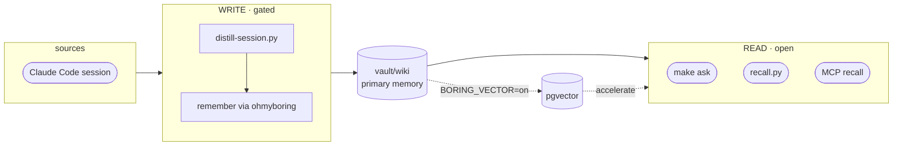

# ohmyboring

**English** · [한국어](README.ko.md) · [日本語](README.ja.md)

[](https://github.com/jazz1x/ohmyboring/actions/workflows/ci.yml)

[](LICENSE)


**ohmyboring remembers how you solved things.** It turns Claude Code / Kimi Code sessions and eligible Codex transcripts into a local, human-readable wiki, then recalls the useful parts when you ask *"how did I do this last time?"* **Zero cloud · local LLM friendly.**

```bash
# Fastest — one-liner: clones to ~/oh-my-boring, builds, wires hooks/MCP/workers.
sh -c "$(curl -fsSL https://raw.githubusercontent.com/jazz1x/ohmyboring/main/install.sh)"
```

Or step by step:

```bash
git clone https://github.com/jazz1x/ohmyboring.git ~/oh-my-boring
cd ~/oh-my-boring
make up
make verify-llm     # verify provider, chat model, embedding model, and vector dimension
make doctor         # verify stack, hooks, Codex worker/queue, and latest ingest
make readiness      # strict gate before relying on morning briefs
make collect N=20   # seed the vault from your past Claude Code sessions (fresh clone starts empty)
make ask Q="how did I fix the docker build cache problem?"
```

> A fresh clone has an **empty vault**, so day-1 `make ask` finds nothing. `make collect` backfills your Claude history; after that, Claude/Kimi sessions auto-accumulate and Codex is picked up by its worker when eligible (see [Feeding it](#feeding-it-ingestion)).

> Requires **Docker**, **Python 3**, **jq**, **curl**, **git**, **make**, and a local LLM server — **Ollama** or **LM Studio** (or another OpenAI-compatible endpoint).

**Pick a local LLM backend:**

- **Ollama** — set `llm.provider` to `ollama`. `make up` ensures `ollama serve` is running and pulls `llm.model` and `llm.embed_model` if they are missing. `make verify-llm` confirms model presence, reachability, and that the embedding dimension matches `llm.embed_dim`.
- **LM Studio** — set `llm.provider` to `lmstudio`. Start its local server and load one chat model and one embedding model manually. `make verify-llm` reads `/v1/models` to confirm exact model ids and calls `/v1/embeddings` to confirm `llm.embed_dim`. No automatic pull.
- **OpenAI-compatible** — set `llm.provider` to `openai-compatible` for vLLM, llama.cpp, or remote OpenAI endpoints. `make verify-llm` checks `/v1/models` and the embedding dimension; no pull.

The same contract applies to every provider: chat and embedding are separate services; `llm.embed_dim` must match the actual vector returned by the embedding model; changing the embedding model requires updating `llm.embed_dim` and running `make reset`. Provider-specific checklists are in the [Ollama](docs/runbooks/ollama.md) and [LM Studio](docs/runbooks/lmstudio.md) runbooks; the vector/graph guarantees are in the [GraphRAG & Vector contract runbook](docs/runbooks/graphrag.md).

**Pick a memory backend:**

- **`BORING_VECTOR=off` (default)** — wiki-first. `vault/wiki` is read directly. `/ask`, `/search`, `recall`, and `context` work without Postgres; recency/claim/graph endpoints (`brief`, `weekly_brief`, `project_status`, `decisions`, `risks`, `next_actions`, `stalled`, `neighbors`, `claims`, `events`, `corpus_status`) return an explicit error until vector mode is enabled.
- **`BORING_VECTOR=on`** — pgvector accelerates semantic search, the graph (node/edge tables + recursive CTE), claim registers, and the local event/query logs. `make sync` re-ingests `vault/wiki` into embeddings and graph edges.

First-run success means:

- `make up` exits 0 and `http://127.0.0.1:7700/health` returns 200.
- `make verify-llm` sees both configured model ids and the actual embedding dimension matches `llm.embed_dim`.
- `make doctor` shows stack, hooks/MCP, worker/queue, and latest ingest state without hidden failures.
- `make readiness` is green before you trust a scheduled morning brief.

---

## What it does

1. **Auto-accumulate** — when a session ends, or when the Codex worker finds an eligible transcript, it becomes a curated markdown note in `vault/wiki`. No manual upkeep.
2. **Markdown-first memory** — plain, human-readable, git-diffable notes. Recall reads them directly.
3. **Local-only** — embedding and synthesis run on your machine via Ollama, LM Studio, or another OpenAI-compatible endpoint. No external APIs or tokens.

Optional **pgvector** accelerator (`BORING_VECTOR=on`) adds similarity search + GraphRAG when scale calls for it.

## Memory contracts

ohmyboring is intentionally opinionated: memory is not a pile of chat logs, but a set of small contracts that keep recall honest.

| Contract | What it guarantees |
| --- | --- |
| **Chunking** | Note bodies are split into 1,500-character chunks with 200-character overlap. Short notes stay whole. Each chunk is embedded independently and stored as `source_path#chunk_idx`, so long sessions remain searchable without losing nearby context. |
| **Slicing** | Read surfaces cut memory before it reaches the agent. MCP `recall` is bounded by `max_results`, `max_tokens`, `project`, and `since_hours`; wiki-first recall tie-breaks equal scores by `source_path`; synthesis prompts have a fixed 6,000-character context ceiling, and `ask` source lists name only hits that fit inside that capped prompt plus injected graph/claim evidence; brief/status paths prefer newest source notes and current claims, while single-project brief slices scope injected current/stalled claims to that project, and briefing related context is capped to 4 seed docs, 3 related docs, and 1,000 characters per related record. Generated daily briefs and eval fixtures are excluded from source-memory slices, and eval fixtures are pruned or filtered away from briefing surfaces. |
| **Ingestion** | The per-file pipeline is one-way: read, parse frontmatter, chunk, embed, `upsert`, `prune`, and project links. The actual file path is authoritative for document/chunk `source_path`, even when YAML carries an old `source_path`; raw evidence pointers belong in `sources`. Frontmatter identity fields (`origin`, `project`, `kind`) are trimmed at the parse boundary before DB filters or relation lanes see them. `sha` tracking skips unchanged files; changed files write fresh chunks with `upsert` before stale tail chunks are removed by `prune`; generated briefs are skipped so summaries never become source memory. |
| **Raw witness** | Session distillation first copies the raw transcript to a gitignored local witness file under `data/raw-witness/`, then extracts and distills from that snapshot. Notes store only a local `raw-witness/...#sha256=...` source pointer, so provenance is auditable without putting raw chat logs into the RAG corpus. Raw witness snapshots are fsynced before publish, and a failed publish leaves the previous target plus no temp witness behind. The `#sha256` fragment remains required even if retention has pruned the local bytes; missing bytes are a retention warning, not a weaker provenance contract. Capacity is an explicit retention contract, not an unbounded hidden cache: expected footprint is roughly average raw transcript bytes per day × `BORING_RETENTION_RAW_WITNESS_DAYS` (default `90` days). `make retention` reports the total raw-witness footprint (actual count and bytes), and can prune old snapshots or let you move them with `BORING_RAW_WITNESS_DIR`. |
| **Claims** | Claims are temporal facts. Canonical `(subject, predicate)` is the identity, `value` is the current state, and `kind`/`confidence` say how to use it (`fact`, `decision`, `assumption`, `risk`, `blocked`, `goal`, `term`, `next`). Subject/predicate casing and separator variants collapse before storage, so newer values supersede older rows while provenance stays on `source_path`; briefings can prefer current decisions, risks, blockers, and next actions over stale prose. |
| **Graph** | The graph is deterministic. Tools, concepts, and claims come from agent-curated frontmatter, not from an extra LLM extraction pass inside `drudge`. Obsidian `relates_to` links are projected from claim continuity, exact tool/concept overlap, corroborated semantic neighbors, and a small same-project recency fallback, capped so hub notes do not explode into a mesh. Graph-linked context carries shared graph-node evidence (`shares N graph nodes: ...`), and briefing related context can also carry claim-axis evidence (`shares N claim axes: ...`), so related records stay explainable instead of becoming embedding-only guesses. The GraphRAG content lane stays stricter: it uses only shared tool/concept graph nodes, while claim-axis continuity stays in its own related/claim-authority lane so status history does not masquerade as extra GraphRAG evidence. If one related document is reached through multiple seed records or both graph-node and claim-axis lanes, its heading merges those seed paths and reasons instead of emitting duplicate related records; same-kind evidence nodes are deduplicated before the count is shown, stronger merged candidates are ranked before the related-document cap is applied, exact ranking ties fall back to `source_path`, and briefing related context stays inside each seed record's project unless a caller explicitly selects another project. Briefing post-processing drops leaked relation-metadata bullets, so relation reasons do not become action items. When `remember` writes a note, that note's `relates_to` projection is immediate; neighboring notes' backlinks are reconciled by the next `sync` / full `project_links` pass, so recall is immediate while Obsidian links are eventually consistent. |

### GraphRAG implementation note

When `BORING_VECTOR=on`, `/ask` runs local GraphRAG. It first builds a candidate pool from vector similarity and BM25 full-text search, merges them with RRF, then expands the neighborhood through shared `uses`/`about` tool/concept graph nodes using a configurable **multi-hop traversal** (default depth is 2 document-to-document hops). A lightweight **graph reranker** keeps the top vector hit as an anchor and rescores the rest using shared graph nodes, shared claim axes, graph degree, and recency decay. The top related documents are injected into the synthesis prompt, each capped so the context budget stays bounded. `/search` deliberately keeps the raw RRF ranking as the external recall contract, so `make eval-graphrag` can A/B test vector-only retrieval against the full GraphRAG path on `data/eval/graph-golden.json` and report Recall@3 plus graph-only rescue. Query telemetry records `graph_context_chars` and `graph_source_count` for every `/ask` call so the graph lane stays observable. See the [GraphRAG & Vector contract runbook](docs/runbooks/graphrag.md) for the full contract, current limits, and observability notes.

What is not implemented yet is a neural graph reranker or arbitrary edge-kind expansion beyond `uses`/`about`; the current deterministic feature-based mixer is bounded, cheap, and sufficient for personal-memory scale. If future evals show recall gaps that deeper or learned reranking can close, the schema already supports k-hop recursive CTEs and can be migrated to a graph DB without changing the API contract.

These contracts represent the project's philosophy: `vault/wiki` is the source of truth, raw witnesses are local evidence, the database is rebuildable acceleration, and every boundary should say what it knows instead of guessing. Raw sessions are refined once at the write door; reads stay fast, bounded, local, and explainable.

---

## Feeding it (ingestion)

Memory gets in four ways — after setup you rarely touch the automatic paths:

| How | Command | When |
| --- | --- | --- |
| **Automatic, on session end** | SessionEnd hook (wired by `install.sh`) | every Claude Code / Kimi session — `hooks/distill-session.py` distills the transcript and `remember`s it. The paired `UserPromptSubmit` hook (`recall.py`) auto-injects relevant past memory into new prompts. |
| **Automatic, Codex worker** | host launchd/cron worker (wired by `install.sh`) | Codex has no SessionEnd hook. The host worker is the canonical write path: it scans `~/.codex/sessions/**/*.jsonl` every 20 minutes, skips transcripts still being written, keeps true subagent rollouts out, and stores eligible transcripts through the same `remember` path. If `hermes-agent` is enabled, it may also run a duplicate `codex-memory-ingest-worker`; `make doctor` reports that optional worker as a notice when the host worker is healthy. |
| **Backfill past sessions** | `make collect [N=20]` | once after install, to seed an otherwise-empty vault from your `~/.claude/projects` history. Newest-first, idempotent (a per-session marker skips already-distilled ones), `N` per run so it never hogs CPU. |
| **Right now, mid-session** | `make distill-now` · `make remember M="…"` | capture something immediately *without* ending the session. `distill-now` re-distills the **current** transcript on demand and leaves no marker, so the normal end-of-session capture still runs (you may get an early note plus the final one). `remember` saves an explicit note you write yourself. |

### Wiring the hooks manually

`install.sh` does this for you. To redo it (or if you ran with `BORING_WIRE=0`):

```bash
python3 agents/shared/agent_wiring.py --install \
  --boring-home ~/oh-my-boring --server-name ohmyboring \
  --server-url http://localhost:7700/mcp
```

This installs Claude/Kimi hooks, Cursor/Codex MCP entries, the Codex host worker, and Hermes cron workers when `hermes-agent` is enabled. Or edit `~/.claude/settings.json` by hand for Claude only: a `SessionEnd` hook running `python3 ~/oh-my-boring/hooks/distill-session.py`, plus a `UserPromptSubmit` hook running `recall.py`.

---

## Viewing your memory

The notes are just markdown, so **open the `vault/` folder as an [Obsidian](https://obsidian.md) vault** — graph view, backlinks, tags, and full-text search come for free. The compiled notes already carry Obsidian-safe `tags` and `[[wiki-NNNN]]` `relates_to` links, so the graph view draws your memory's connections directly (richest with `BORING_VECTOR=on`, which projects the GraphRAG graph into those links). After `remember`, the new note's links are updated first; neighbor backlinks catch up on the next `sync`. No custom UI to build. Obsidian's own `.obsidian/` workspace folder is gitignored, so your layout stays local and never leaks into git.

---

## Architecture



- **Read door** — local and bounded. `recall.py` and MCP `recall` read `vault/wiki` directly without LLM synthesis; `make ask` / HTTP `/ask` use the same wiki-first retrieval when vector is off, then run the local synthesis model.
- **Write door** — gated. `distill-session.py` calls the local LLM and writes through ohmyboring's deterministic `remember` MCP tool.
- **Duplicate gate** — duplicate notes are normally skipped; if the same session or a strong rollout/manual duplicate produces a richer note, `remember` rewrites the same `wiki-NNNN.md` and re-ingests it. Non-session duplicates require conservative identity signals plus project and origin compatibility, not topic overlap alone. Missing or blank project frontmatter is treated as absent and derived from the file path before that compatibility check.
- **Write-maintenance lock** — vector-mode `sync`, `compact`, `remember`, and `forget` share one `sync_lock` when they rewrite DB-backed graph/relation state. Bulk writes wait instead of interleaving with full-corpus link projection; `/health` reports this lane as `sync: running`.

### Workflow graph contract

The ingest loop also has a Rust-side workflow graph contract in `drudge/src/workflow.rs`, documented in `drudge/WORKFLOW.md`. It is a LangGraph-style typed state graph for session discovery, distillation, resolution verification, repair, `remember`, marker update, event logging, and readiness projection. It is not a second runtime orchestrator: Python hooks/workers still perform host I/O, while Rust owns the closed node/edge vocabulary and graph-shape tests.

---

## Configuration

Policy lives in **`boring.json`** (created from `boring.example.json` by `make up`):

```json
{
  "$schema": "https://raw.githubusercontent.com/jazz1x/ohmyboring/main/boring.schema.json",
  "schema_version": 2,
  "note_lang": "auto",
  "llm": {
    "provider": "ollama",
    "base_url": "http://host.docker.internal:11434/v1",
    "model": "qwen3:14b",
    "embed_model": "bge-m3",
    "embed_dim": 1024,
    "api_key_env": "BORING_LLM_API_KEY",
    "bootstrap": "auto"
  },
  "repos": [
    {"match": "your-company", "origin": "company", "name": "your-company"},
    {"match": "~/code", "origin": "personal", "name": "mine"}
  ],
  "agents": [
    {"id": "claude-code", "enabled": true, "format": "claude-json", "paths": ["~/.claude/projects"]}
  ]
}
```

| Key | Purpose |
|---|---|
| `note_lang` | `auto` · `ko` · `en` |
| `llm.provider` | `ollama` (pulls models) · `lmstudio` (load in-app, no pull) · `openai-compatible` (vLLM / llama.cpp / remote) |
| `llm.base_url` / `llm.model` | OpenAI-compatible `/v1` endpoint + synthesis model |
| `llm.embed_model` / `llm.embed_dim` | embedding model + its vector dimension (kernel's only model) |
| `llm.bootstrap` | `auto` = bootstrap may start/pull · `manual` = health-check only (you own the server) |
| `repos[]` | path/remote rules → `origin=personal/company/mirror/community` |
| `agents[]` | ingest sources for vector mode |

The `classify_repo` MCP tool updates this same file: it rejects invalid `origin` values before writing and publishes the edited JSON through the same-directory atomic write boundary.

**Switching LLM backend** is one config block. `make up` dispatches to `scripts/llm-providers/<provider>.sh` for the right bootstrap.

### Local LLM backends

ohmyboring can connect to any OpenAI-compatible `/v1` server. The officially supported backends are **Ollama** and **LM Studio**; other OpenAI-compatible endpoints (vLLM, llama.cpp, remote) work with `llm.provider=openai-compatible` but are not officially supported.

#### Ollama

Default in `boring.example.json`. `make up` dispatches to `scripts/llm-providers/ollama.sh`, which ensures Ollama is running and pulls `llm.model` / `llm.embed_model` if needed. Inside the Docker container, use `host.docker.internal` to reach the host Ollama; the default `boring.json` already does this.

Quick check/start:

```bash
make ollama
curl -s http://localhost:11434/api/tags
make verify-llm
```

#### LM Studio

LM Studio works through its OpenAI-compatible `/v1` server. Use `host.docker.internal` in `boring.json` because the Docker container calls back to the host; use `localhost` only for host-side checks and benchmarks.

```json
{
  "llm": {
    "provider": "lmstudio",
    "base_url": "http://host.docker.internal:1234/v1",
    "model": "<exact chat model id from /v1/models>",
    "embed_model": "<exact embedding model id from /v1/models>",
    "embed_dim": 768,
    "api_key_env": "BORING_LLM_API_KEY",
    "bootstrap": "manual"
  }
}
```

Start the LM Studio local server, load one chat model and one embedding model, then verify before `make up`:

```bash
curl -s http://localhost:1234/v1/models | jq -r '.data[].id'
make verify-llm
make up
make doctor
make readiness
```

The model ids must match what LM Studio reports. `make verify-llm` also calls `/v1/embeddings` and checks that the returned vector length matches `llm.embed_dim`. For the current 1024d release path, LM Studio is vector-ready only when it can serve `bge-m3`; `text-embedding-nomic-embed-text-v1.5` is a separate 768d reset/re-index path. See the [LM Studio runbook](docs/runbooks/lmstudio.md) and [Ollama runbook](docs/runbooks/ollama.md) for full checklists, and the [GraphRAG & Vector contract runbook](docs/runbooks/graphrag.md) for the vector/graph guarantees.

`.env` is now only secrets + runtime overrides:

| Variable | Purpose |
|---|---|
| `BORING_VECTOR` | `on` enables pgvector (optional) |
| `BORING_LLM_BASE_URL` / `BORING_LLM_MODEL` | optional runtime override of `llm.base_url` / `llm.model`. Running the `drudge` binary directly on the host? Set `BORING_LLM_BASE_URL=http://localhost:11434/v1` |
| `BORING_LLM_API_KEY` | API key when `llm.api_key_env` points here (auth providers) |
| `DOCKER_BIN` | optional Docker CLI path when GUI/launchd environments do not include Docker in `PATH` |
| `BORING_DISTILL_RESOLUTION` | distillation detail contract: `compact`, `standard`, `evidence` (default), or `forensic`; invalid values fail before distillation starts; verifier failures repair once, then block `remember` |
| `BORING_RAW_WITNESS_DIR` | optional override for raw transcript witness snapshots; defaults to gitignored `data/raw-witness` under `BORING_HOME` |
| `BORING_RETENTION_RAW_WITNESS_DAYS` | raw witness snapshot retention window for `make retention`; defaults to `90` days |
| `DISTILL_CLAMP` | max characters sent by the Claude/Kimi direct SessionEnd hooks to the local LLM; defaults to `2000` to avoid local-model timeouts. `0` disables clamping; invalid or negative values fail before distillation. Hermes worker offers use the same clamp contract through `INGEST_CLAMP` (`4000`) |
| `CODEX_DISTILL_CLAMP` | max extracted Codex session characters sent to the distill LLM; defaults to `INGEST_CLAMP`, then `4000`. `0` disables clamping; invalid or negative values fail before distillation starts |
| `BORING_EVENT_LOG` | local NDJSON fallback spool; defaults to `~/.cache/oh-my-boring/events.ndjson` |
| `BORING_EVENT_SINK` | event sink mode: `db` (default), `spool`, or `both`. `db` writes the engine DB first and spools only on failure |
| `BORING_EVENT_SPOOL` | fallback spool policy: `on_failure` (default when DB is enabled), `always`, or `off` |
| `BORING_EVENT_SINK_URL` | optional explicit DB event endpoint; defaults to `$BORING_URL/events` |
| `BORING_EVENT_SINK_TIMEOUT` | positive HTTP timeout in seconds for event sink DB calls; defaults to `0.5`, and invalid or non-positive values fail before event sink I/O |
| `BORING_EVENT_DB_MIRROR` | legacy compatibility alias; `0`/`false`/`off` means `BORING_EVENT_SINK=spool`, `1`/`true`/`on` means `both` |
| `BORING_EVENT_RECENT_HOURS` | recent event window used by `make readiness`; positive integer hour window, defaults to `24`, and invalid or non-positive values fail before recent-event reads |
| `BORING_READINESS_NOTE_MAX_HOURS` | newest-note freshness window for briefing readiness; defaults to `48` |
| `BORING_READINESS_PENDING_TTL` | stale `.pending` marker threshold for readiness; falls back to `INGEST_PENDING_TTL`, then `1800` seconds |
| `BORING_READINESS_RETRY_TTL` | stale `.retry` marker threshold for readiness; falls back to `INGEST_RETRY_TTL`, then the pending threshold |
| `SLACK_APP_TOKEN` / `SLACK_BOT_TOKEN` | optional Slack assistant |

Structured events are emitted by distill, collectors/workers, `doctor`/`readiness`, `guard`, and `eval`. Memory-ingest events carry `workflow=memory_ingest`, `workflow_node`, and `workflow_outcome` fields that mirror the Rust workflow graph contract. Events are stored in the local engine DB first as OpenTelemetry-shaped log records; the NDJSON file is a fallback spool for engine-down cases unless you choose `BORING_EVENT_SINK=spool` or `both`. The fallback spool writes fsynced complete NDJSON lines while preserving append-only semantics. Use HTTP `/events` (or the `/otel-events` alias) or MCP `events` for the DB view; use `make events` for the DB view with automatic fallback to the file spool.

> **Swapping the embedding model changes the vector dimension.** The synthesis model (`llm.model`) is free to swap, but a new `llm.embed_model` emits vectors of a different size, so you must update `llm.embed_dim` to match **and** run `make reset` — otherwise upserts fail against the old-shaped vectors. Common dims: `bge-m3` = 1024 · OpenAI `text-embedding-3-small` = 1536 · `nomic-embed-text` = 768.

### Local model selection

ohmyboring runs two local models: a **synthesis model** for distillation/ask, and an **embedding model** for vector search. The synthesis model can be changed freely; the embedding model can too, but it requires updating `llm.embed_dim` and running `make reset`.

Below is a same-scale pairing guide by MacBook RAM. If a tier has no viable model in one family, the cell is left empty.

| MacBook RAM | gemma4 (Google) | qwen3 (Alibaba) | Notes |
|------------:|-----------------|-----------------|-------|
| 8 GB | — | `qwen3:4b` | Gemma4 has no practical 8 GB option. |
| 16 GB | `gemma4:12b` | `qwen3:14b` | Closest same-scale dense pair (12B vs 14B). |
| 24 GB | `gemma4:26b-a4b` | `qwen3:30b-a3b` | Same-scale MoE pair. |
| 32 GB | `gemma4:31b` | `qwen3:32b` | Dense flagship pair. |
| 48 GB | `gemma4:31b` | `qwen3:32b` | Same models, with headroom for context/apps. |
| 64 GB+ | — | — | No practical new local pair; `qwen3:235b-a22b` needs ~142 GB disk. |

Benchmark commands:

```bash
# LLM distillation benchmark by RAM tier
make bench-llm                  # default 16 GB tier
make bench-llm-tier TIER=32gb

# Embedding model benchmark (dim / latency / sanity)
make bench-embed
```

Measured on a MacBook Pro (M5 Pro, 48 GB RAM) with local Ollama. The 16 GB tier pair (`gemma4:12b` vs `qwen3:14b`) hits 100% valid JSON, target-language title, 2+ body sections, and clean body in Korean and English; in Japanese `qwen3:14b` occasionally reverts to Korean titles (67% Japanese-title rate on 3 samples) while `gemma4:12b` and `qwen3:8b` stay at 100%. Average latency: `gemma4:12b` ~13–16 s, `qwen3:14b` ~12–18 s, `qwen3:8b` ~6–8 s. `bge-m3` embedding averaged **0.105 s** per text and passed the cosine sanity check.

See [`docs/reports/llm-pair-matrix.md`](docs/reports/llm-pair-matrix.md) for per-language tables, tag sizes, methodology, and LM Studio notes.

### Naming layers

One name per layer — the `ohmyzsh` ↔ `~/.oh-my-zsh` pattern. Only the layer changes, not the thing:

| Layer | Name | Appears in |
|---|---|---|
| Brand / repo / MCP server | `ohmyboring` | repo URL, `.mcp.json`, `--server-name` |
| Install dir / compose project | `~/oh-my-boring` | clone path, `BORING_HOME`, compose project name |
| Engine package / binary | `drudge` | `Cargo.toml`, source, the `drudge` CLI |
| Containers | `boring-*` | `boring-drudge` · `boring-postgres` · `boring-agent` |
| Env-var prefix | `BORING_*` | `BORING_VECTOR` · `BORING_URL` · `BORING_LLM_*` · `BORING_VAULT_DIR` · `BORING_HOME` |

---

## Commands

| Command | Description |
|---|---|
| `make up` | set up + start the ohmyboring engine (hermes-agent joins only if its image exists) |
| `make ollama` | ensure Ollama is running (start in background if needed) |
| `make verify-llm` | verify provider reachability, loaded model ids, and actual embedding dimension |
| `make doctor` | diagnose stack, hooks, latest ingest, and Codex worker/queue status |
| `make heal` | run `doctor --fix` for safe mechanical repairs only: env perms, hooks, engine/Ollama/container restart; never reset/restore |
| `make codex-status-strict` | self-verify Codex worker/marker readiness step |
| `make readiness` | strict pre-briefing gate; fails on model/embed, hook, container, required worker, stale-marker, or freshness findings |
| `make self-verify-cycle` | run the next self-verification cycle and append `summary.tsv` evidence rows; `CYCLE` selects the expected next cycle, while duplicate or non-contiguous cycles fail |
| `make self-verify-check` | evaluate the live self-verification summary against the stage cursor (`stage.txt`) unless `STAGE` overrides it |
| `make ask Q="..."` | one-shot recall + synthesis |
| `make sync` | deterministic re-ingest of the vault |
| `make vault-cleanup-check` | verify vault cleanup contract and write an atomic report without rewriting notes |
| `make vault-cleanup-fix` | fsynced tar backup of `vault/wiki`, apply safe atomic steward repairs, write an atomic report, then verify |
| `make steward` | inspect vault data hygiene (project variants, placeholder tags, missing sources) |
| `make steward-fix` | apply safe data-steward repairs through the backup-first cleanup gate |
| `make retention` | plan/apply raw session and raw-witness retention; gzip archives are fsynced before source transcript removal |
| `make remember M="text"` | write a one-line note |
| `make collect [N=1]` | lazy backfill of past Claude Code sessions |
| `make collect-kimi [N=1]` | lazy backfill of past Kimi Code sessions |
| `make hermes-build` | clone/build the optional hermes-agent image |
| `make smoke` | end-to-end smoke test |
| `make logs` | engine logs |
| `make events [N=20]` | show recent workflow events from the engine DB, falling back to the local spool |
| `make recent-events [N=20]` | self-verify recent-events step; same DB-first/file-fallback view |
| `make code-index` | Full-refresh the AST code graph from current sources (tree-sitter; Rust/Python/TS/Kotlin). `remember_code` note edges survive the refresh (requires `BORING_VECTOR=on` + `code_index.enabled`) |
| `make code-hotspots` | repeated code-lane queries mined from query_log — what the agent keeps forgetting |
| `make eval` | behavioral regression gate for recall/answer quality (live stack; Recall@3 floor on `data/eval/golden.json`) |
| `make eval-graphrag` | GraphRAG contribution gate: A/B compares `/search` (vector-only) vs `/ask` (vector + graph + claim + LLM) and reports graph-only rescue |
| `make eval-code` | code-lane behavioral gate: `/code-search` must find every golden fixture symbol in `data/eval/code-fixtures/` |
| `make guard` | stack-free structural gate: Rust, Python, shell guardrails, vault hygiene dry-run, and temp-spooled guard events |
| `make quality` | release acceptance drift gate |
| `make maintenance` | run unattended housekeeping now (backup-first vault cleanup + retention --apply --yes) |
| `make down` | stop containers |

### Self-verification loop contract

`make self-verify-cycle` records evidence rows in `/private/tmp/omb-self-verify/<run>/summary.tsv`, streams per-step stdout/stderr logs under `/private/tmp/omb-self-verify/<run>/logs/`, writes child step events to `/private/tmp/omb-self-verify/<run>/events.ndjson`, and keeps the stage cursor beside them as `/private/tmp/omb-self-verify/<run>/stage.txt`. Summary appends are fsynced, atomically replaced, and followed by a parent-directory fsync; the stage cursor uses the same durable publish boundary, so readers never observe a truncate-then-write half state. Each step log starts with unambiguous parseable `key=value` execution metadata, including the matching cycle, step, run-local event log path, and a header timestamp inside that summary row's time window, before command output; it ends with a fsynced, unambiguous parseable `key=value` completion footer carrying cycle, step, exit code, and end timestamp. Child event records also carry self-verify summary, event-log, cycle, and step provenance; the producer rejects partial or non-positive self-verify provenance before writing, and self-verify forces child event writes to this run-local spool instead of relying on the default DB-first event sink. With no `CYCLE` selection it creates cycle 1 for a new run, then appends the next contiguous cycle to the newest run; with `CYCLE`, the selected cycle must still be the expected next cycle, so duplicate and skipped cycles fail. Every cycle runs `codex-status-strict`, `readiness`, `quality`, and `recent-events`; cycle 1 and every 6th cycle also run `guard`. `make self-verify-check` reads and writes `stage.txt` unless `STAGE` overrides it; a `STAGE` override is a read-only evaluation override and may be `bootstrap`, `soak-2h`, `day`, or `release-candidate`. The cursor advances only when rows are ordered, gap-free, duplicate-free, successful, backed by matching non-empty step logs whose header timestamps fall inside the summary row windows and completion footers match the summary rows, plus a parseable non-empty event spool whose records have matching self-verify provenance, the expected step event shape, timestamps inside the referenced step windows, and coverage for the event-emitting steps (`codex-status-strict`, `readiness`, and scheduled `guard`), and meet the stage thresholds: `bootstrap` = 1 cycle + 1 guard, `soak-2h` = 6 cycles + 2 guards, `day` = 72 cycles + 13 guards. Duplicate step rows are reported as `duplicate_step_rows`, not as an incomplete cycle. `release-candidate` is terminal but not exempt: it still revalidates the full `day` threshold. On pass, the stage cursor moves `bootstrap` → `soak-2h` → `day` → `release-candidate`; on failure, `next` remains the current stage and failed steps print their log path as evidence.

---

## Usage examples

### Backfill all supported agents

```bash
# Claude Code (default make collect)
make collect N=20

# Kimi Code
make collect-kimi N=20

# GitHub Codex (normally handled by the host worker)
make doctor
COLLECT_LIMIT=20 python3 agents/codex/collect-sessions.py
```

### Daily/weekly consumption

```bash
# Structured context card for the start of a session (works with BORING_VECTOR=off)
curl -s -X POST http://localhost:7700/context \
  -H 'content-type: application/json' \
  -d '{"project":"omb","max_items":5}' | jq .

# Morning brief — last 24 hours (requires BORING_VECTOR=on)
curl -s -X POST http://localhost:7700/brief \
  -H 'content-type: application/json' \
  -d '{"project":"omb","since_hours":24}' | jq .

# Weekly brief — last 7 days (requires BORING_VECTOR=on)
# Omit `since_hours` to use the default 7-day window; pass a value to override it.
curl -s -X POST http://localhost:7700/weekly \
  -H 'content-type: application/json' \
  -d '{"project":"omb","since_hours":168}' | jq .

# Preview the exact Slack-bound morning brief text
BORING_URL=http://127.0.0.1:7700 python3 agents/hermes/briefing.py

# Stalled register — things that have not moved in 7+ days (requires BORING_VECTOR=on)
curl -s -X POST http://localhost:7700/stalled \
  -H 'content-type: application/json' \
  -d '{"project":"omb","older_than_days":7}' | jq .
```

Hermes cron sends briefing script stdout as Slack `mrkdwn` text. `make eval` fixture notes are searchable during the gate but are pruned afterward and excluded from recency/claim briefing surfaces so test corpus entries do not appear in daily or weekly digests. Scheduler-written `daily-brief-*.md` files are kept in `vault/wiki` as generated output artifacts, but their `daily-brief` tag excludes them from readiness/health source-corpus checks, recall, vector/claim briefing surfaces, duplicate candidates, ingest confirmation markers, Obsidian relation projection, and DB ingest so summaries do not become source memory.

### PII / sensitive-data gate

Policy lives in `vault/rules/pii.yaml` and an optional gitignored `vault/rules/pii.local.yaml`:

```yaml
# vault/rules/pii.local.yaml — company-specific shapes, never commit
version: "1.0"
policy:
  default_action: flag
  exemption_marker: "<!-- pii-allow:"
rules:
  - name: internal-ticket
    regex: '\bPROJ-\d{4,}\b'
    action: flag
    severity: warning
    reason: "Internal ticket id"
  - name: staging-password
    regex: '\bstaging[_-]?pass\s*=\s*[^\s]+'
    action: redact
    replacement: "[STAGING-PASS]"
    severity: critical
    reason: "Staging credential"
```

A `block` rule rejects the note at `remember` time; a `redact` rule masks matches before saving; a `flag` rule saves the note and adds a `pii-flag` tag. To let a flagged shape through on one line, add the exemption marker on that line:

```markdown
The Jira ticket PROJ-1234 <!-- pii-allow: internal-ticket --> is public.
```

### MCP tool call (raw JSON-RPC)

```bash
curl -s -X POST http://localhost:7700/mcp \
  -H 'content-type: application/json' \
  -d '{
    "jsonrpc": "2.0",
    "id": 1,
    "method": "tools/call",
    "params": {
      "name": "recall",
      "arguments": {
        "query": "docker build cache fix",
        "max_tokens": 1500,
        "max_results": 3,
        "project": "omb",
        "since_hours": 168
      }
    }
  }' | jq .
```

---

## Agent adapters

`agents/` contains the **host-side adapters** that connect external agents to the ohmyboring engine. Every adapter talks to ohmyboring through the same MCP/HTTP surface; none are required.

The old `hooks/` path still works as a set of backward-compatible symlinks, so existing Claude Code `settings.json` entries and cron jobs don't break.

| Adapter | Path | Consumer | Entry point | What it does |
|---|---|---|---|---|
| Claude Code | `agents/claude-code/distill-session.py` | `SessionEnd` / `Stop` hook | `~/.claude/settings.json` | Distills a session and calls `remember` |
| Claude Code | `agents/claude-code/session-start-recall.py` | `SessionStart` hook | `~/.claude/settings.json` | Loads structured context (`/context`) before the first turn |
| Claude Code | `agents/claude-code/recall.py` | `UserPromptSubmit` hook | `~/.claude/settings.json` | Pulls relevant snippets and injects them as prompt context |
| Kimi Code | `agents/kimi/distill-session.py` | `SessionEnd` hook | `~/.kimi-code/config.toml` | Distills a Kimi session and calls `remember` |
| Kimi Code | `agents/kimi/recall.py` | `UserPromptSubmit` hook | `~/.kimi-code/config.toml` | Pulls relevant snippets and injects them as prompt context |
| Cursor | `agents/cursor/README.md` | MCP only | `~/.cursor/mcp.json` | Exposes `ohmyboring` as an MCP server |
| Codex | `agents/codex/README.md` | MCP + host worker backfill | `~/.codex/mcp.json` / launchd or cron / `collect-sessions.py` | Exposes `ohmyboring` as an MCP server and backfills eligible Codex sessions; installed workers harvest stable rollout transcripts but skip true subagents |
| hermes-agent | `agents/hermes/` | `hermes cron --script` + MCP | `~/.hermes/cron/jobs.json` + `~/.hermes/scripts/` | Config-driven cron (`weekly-briefing`, `briefing`) + serial backfill workers (`ingest-worker.py`, Codex collector) |
| scheduler | `agents/schedulers/collect-sessions.py` | cron / launchd / manual | user crontab / launchd plist (wired by `install.sh`) | Lazy backfill of older Claude Code sessions |
| scheduler | `agents/schedulers/collect-kimi-sessions.py` | cron / launchd / manual | user crontab / launchd plist (wired by `install.sh`) | Lazy backfill of older Kimi Code sessions |
| shared | `agents/shared/boring_config.py` | imported by adapters | `boring.json` | `boring.json` policy loader |
| shared | `agents/shared/agent_wiring.py` | `install.sh` | `install.sh` | Idempotently configures hooks/MCP for enabled agents |

### Consumption endpoints

Memory can be reached through HTTP endpoints or the MCP server (`http://localhost:7700/mcp`):

| Endpoint / MCP tool | Purpose | Vector backend |
|---|---|---|
| `POST /context` / `context` | Structured context card: decisions, risks, facts, glossary, next_actions | not required |
| `POST /next_actions` / `next_actions` | Next-action register: explicit next steps + active blockers | required |
| `POST /stalled` / `stalled` | Stalled register: old next steps and blockers | required |
| `POST /status` / `project_status` | 30-day project status (Done/Next/Blocked/Decisions/Risks) | required |
| `POST /weekly` / `weekly_brief` | Last 7 days across projects (override with `since_hours`) | required |
| `POST /decisions` / `decisions` | Decision claims for a project | required |
| `POST /risks` / `risks` | Risk/assumption/blocked claims for a project | required |
| `POST /ask` / `ask` | Direct question answered from memory | not required |
| `POST /search` / `recall` | Raw memory excerpts | not required; semantic search uses vector when enabled |
| `/remember` / `remember` | Store a curated note | — |

### Token budget

Automatic retrieval can explode an agent's context window, so the retrieval surface is budget-aware:

- MCP `recall` and HTTP `/search` accept `max_tokens`, `max_results`, `project`, and `since_hours`.
- MCP `ask` and HTTP `/ask` accept `project` and `since_hours` to narrow retrieval.
- Time-window arguments such as `since_hours` and `older_than_days` are nonnegative integers; negative values fail at the input boundary.
- `/context` caps each section at `max_items` (default 5) and needs no vector search.
- `recall.py` caps its prompt-injection context via `RECALL_MAX_TOKENS` / `RECALL_MAX_RESULTS`; context caps and timeout must be positive, while retries/session throttle may be `0` but not negative.
- `ask`/`brief` synthesis keeps retrieved context under a fixed character ceiling.

### Other agents

Any MCP-capable agent can use ohmyboring. The repo ships a standard **`.mcp.json`** (root key `mcpServers`) that Claude Code, Cursor, Windsurf, and Claude Desktop read when it is placed in a project directory or user config path:

```json
{ "mcpServers": { "ohmyboring": { "type": "http", "url": "http://localhost:7700/mcp" } } }
```

`install.sh` automatically wires:
- Claude Code hooks in `~/.claude/settings.json`
- Kimi Code hooks in `~/.kimi-code/config.toml`
- Cursor's `~/.cursor/mcp.json` and Codex's `~/.codex/mcp.json` when those agents are enabled in `boring.json`

For other agents, copy the root `.mcp.json` to the appropriate location (e.g. `~/.claude/mcp.json` for Claude Desktop or `~/.kimi-code/mcp.json` for Kimi Code MCP) or use the agent's CLI to add the HTTP MCP server.

(VS Code Copilot uses `.vscode/mcp.json` with the root key `servers`. CLI alt: `claude mcp add --transport http --scope project ohmyboring http://localhost:7700/mcp`. Compose siblings reach it at `http://boring-drudge:7700/mcp`.)

Available tools (20): `recall`, `neighbors`, `claims` (retrieval) · `ask`, `brief`, `weekly_brief`, `project_status`, `decisions`, `risks`, `next_actions`, `stalled` (generative — run the LLM) · `context`, `corpus_status`, `events`, `config_get` (structured / introspection) · `remember`, `remember_code`, `forget`, `classify_repo`, `sync` (write / maintain).

In the default wiki-first mode (`BORING_VECTOR=off`), tools that rely on recency/vector ordering, the graph, or the local event DB return JSON-RPC `-32603` until you set `BORING_VECTOR=on`: `neighbors`, `claims`, `corpus_status`, `events`, `brief`, `weekly_brief`, `project_status`, `decisions`, `risks`, `next_actions`, `stalled`. `recall` and `ask` read `vault/wiki` directly; `context` is callable but returns an empty claim card without the store; `remember`, `remember_code`, `forget`, `sync`, `config_get`, and `classify_repo` do not require vector mode.

- `next_actions` *(requires `BORING_VECTOR=on`)* — next-action register: recent `next` claims and active `blocked` claims synthesized into a short todo/blocker list. Optionally filter by project.
- `stalled` *(requires `BORING_VECTOR=on`)* — stalled register: `next` and `blocked` claims older than `older_than_days` (default 7).
- `decisions` *(requires `BORING_VECTOR=on`)* — decision register: recent `decision` claims for a project.
- `risks` *(requires `BORING_VECTOR=on`)* — risk register: recent `risk`, `assumption`, and `blocked` claims for a project.
- `neighbors` *(requires `BORING_VECTOR=on`)* — graph traversal from a topic: embeds the query, takes the single closest note, then returns its 1-hop labels (`{hit, graph_neighbors, semantic_neighbors}` JSON). `hit` is the matched note's path; `graph_neighbors` are its project/topic labels and `semantic_neighbors` its shared tool/concept labels — flat strings, not note paths.
- `claims` *(requires `BORING_VECTOR=on`)* — top-k current (non-superseded) `{subject, predicate, value, kind, confidence, source_path}` claims near a query, with source provenance. Optionally filter by `project` and `kinds`.
- `corpus_status` *(requires `BORING_VECTOR=on`)* — KB health snapshot (file/chunk counts, by origin/kind/project, contamination, graph/semantic nodes+edges).
- `events` *(requires `BORING_VECTOR=on`)* — recent workflow/adapter events stored in the DB as OpenTelemetry-shaped records. Filter by component, event, status, run_id, workflow, or since_hours.
- `ask` / `brief` / `weekly_brief` / `project_status` / `decisions` / `risks` / `next_actions` / `stalled` — LLM-running tools: `ask` answers a question with cited sources (works in wiki-first mode); the rest are recency/claim registers that require `BORING_VECTOR=on`.
- `forget` — delete a note by wiki id or exact title. Removes the wiki file and, in vector mode, also purges embeddings, graph edges, and claims; if vector cleanup fails after the wiki delete, the reply says it is partial and the next `sync` prunes the derived artifacts.

Structured tools (`neighbors`, `claims`, `corpus_status`, `events`, `config_get`, `ask`, `brief`, `weekly_brief`, `project_status`, `decisions`, `risks`, `next_actions`, `stalled`, `context`) return native `structuredContent` (JSON) alongside the text block; prose/ack tools (`recall`, `remember`, `remember_code`, `forget`, `sync`, `classify_repo`) return text.

Example MCP call (raw JSON-RPC over HTTP):

```bash
curl -s -X POST http://localhost:7700/mcp \
  -H 'content-type: application/json' \
  -d '{
    "jsonrpc": "2.0",
    "id": 1,
    "method": "tools/call",
    "params": {
      "name": "recall",
      "arguments": {
        "query": "docker build cache fix",
        "max_tokens": 1500,
        "max_results": 3,
        "project": "omb",
        "since_hours": 168
      }
    }
  }' | jq .
```

### Optional: hermes-agent

[hermes-agent](https://hermes-agent.org) is a third-party autonomous supervisor. It can drive Slack, orchestration, and cron-based backfill through ohmyboring's MCP backend. Build the image separately; `make up` picks it up automatically if it exists.

When hermes-agent is enabled in `boring.json`, `make up` wires it automatically:

- Adds `mcp_servers.ohmyboring` to `~/.hermes/config.yaml`
- Installs the canonical `~/.hermes/scripts/briefing.py` (uses `BORING_URL`, with `DRUDGE_URL` as a legacy fallback)
- Validates the connection in `make smoke`

Enable it in `boring.json`:

```json
{
  "id": "hermes-agent",
  "enabled": true,
  "adapter": "cron"
}
```

If you customized `~/.hermes/config.yaml` or `~/.hermes/scripts/briefing.py`, back them up first; `make up` preserves a `.omb-bak` copy before overwriting.

---

## Deployment

| Mode | How |
|---|---|
| **Docker** (default) | `make up` |
| **Native** | `cd drudge && BORING_VAULT_DIR="$PWD/../vault" BORING_HTTP_ADDR=127.0.0.1:7700 cargo run --release -- serve` |

> Native `serve` needs `BORING_VAULT_DIR` — without it `remember` fails with `BORING_VAULT_DIR not set`. It also binds `0.0.0.0:7700` by default; set `BORING_HTTP_ADDR=127.0.0.1:7700` to keep it loopback-only.

---

## Development · guardrails

- SSOT docs: `drudge/{PHILOSOPHY,RUST-STYLE,ENFORCEMENT}.md`
- `make guard` = stack-free structural gate: rustfmt, clippy, Rust tests, Python compile/unit tests, shell guardrails, vault hygiene dry-run, and temp-spooled guard events
- `make quality` = release acceptance drift gate for MCP tools, vector-mode docs, and removed dangerous surfaces
- CI: `rust-gate` · `quality-gate` · `gitleaks` · `cargo-deny` · `trivy` · `compose-config` · `docker-build` · `eval-gate`
- `unsafe_code = "forbid"`

---

## Troubleshooting

| Symptom | Fix |
|---|---|
| `make up` fails | Check Ollama: `curl -sf http://127.0.0.1:11434/api/tags` |
| LM Studio selected but `make up` fails | Start LM Studio's local server, load the exact chat and embedding model ids from `boring.json`, then run `make verify-llm` |
| Port conflict | `lsof -i :7700 -i :5432 -i :11434` |
| Second `make up` / re-clone fails | Run `make down` first — the containers use fixed names and bind `127.0.0.1:7700` / `:5432`, so a second stack collides with the running one |
| Agent not starting | `BORING_CORE_ONLY=1 make up` runs core-only; hermes image must be built separately |
| Linux: container can't reach host Ollama | On Linux, Ollama binds `127.0.0.1` by default, so the container hits a closed port even though `host.docker.internal` resolves. Bind Ollama to all interfaces (`OLLAMA_HOST=0.0.0.0:11434`, then restart it) and/or allow the docker bridge in the host firewall |
| `embedding dim mismatch` errors | Your `/v1/embeddings` output size does not match `llm.embed_dim` in `boring.json`. Update `embed_dim` to match the new model and run `make reset` |
| Healthy? / did the last distill land? | `make doctor` — quick health + last-ingest and Codex worker/queue check |
| Can I rely on tomorrow morning's briefing? | `make readiness` — strict gate; every hook/model/container/ingest finding must pass |
| `make readiness` reports stale markers | Inspect `~/.cache/boring-distill`; marker files are atomically published, and ingest `.pending` files must parse as exactly `session_id`, chunk baseline, and attempt count. Stale `.pending`, `.retry`, or `.dead` markers mean autonomous ingest stopped or needs reconciliation before a scheduled briefing is trusted |
| `make readiness` reports a stale newest note | Run or verify ingestion before relying on briefing output; only widen `BORING_READINESS_NOTE_MAX_HOURS` when the briefing window is intentionally longer |
| What failed most recently? | `make events` — recent DB workflow timeline without raw transcripts |

---

## Keeping Ollama alive

`make up` starts Ollama if it isn't running, but if it stops later, the next session ingest will fail.

- Quick check/start: `make ollama`
- Keep it alive across reboots (macOS):
  ```bash
  brew services start ollama
  ```
- Or run it in a persistent terminal: `ollama serve`

## Periodic sync

The engine schedules a deterministic sync every 4 hours, but if you edit `vault/wiki/` by hand or want fresher vector/graph data, run:

```bash
make sync
```

For automatic periodic sync, add a cron job:

```bash
# Every hour
0 * * * * cd ~/oh-my-boring && make sync >/tmp/omb-sync.log 2>&1
```

---

## Directory

```text
oh-my-boring/
├─ drudge/                  # Rust engine
├─ agents/                  # host-side agent adapters
│  ├─ claude-code/          # Claude Code hooks
│  ├─ hermes/               # hermes-agent cron
│  ├─ kimi/                 # Kimi Code hooks
│  ├─ schedulers/           # cron/launchd backfill
│  └─ shared/               # policy/config library
├─ hooks/                   # backward-compatible symlinks → agents/
├─ scripts/                 # guard.sh · smoke.sh
├─ vault/                   # raw → wiki memory
├─ data/                    # Postgres persistence (gitignored)
├─ docker-compose.yml
├─ start.sh
├─ boring.json              # policy (created by make up)
└─ Makefile
```

> **Note on vault/wiki IDs:** `wiki-0000.md` is the tracked sample note (shipped with the repo). Personal notes start at `wiki-0001.md` and are gitignored, so your private content never leaks into git.
>
> **Platform note:** Tested on macOS and Linux. Windows is not officially supported yet because `hooks/` uses symlinks for backward compatibility.
